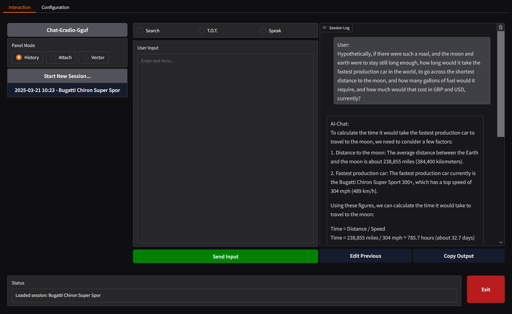
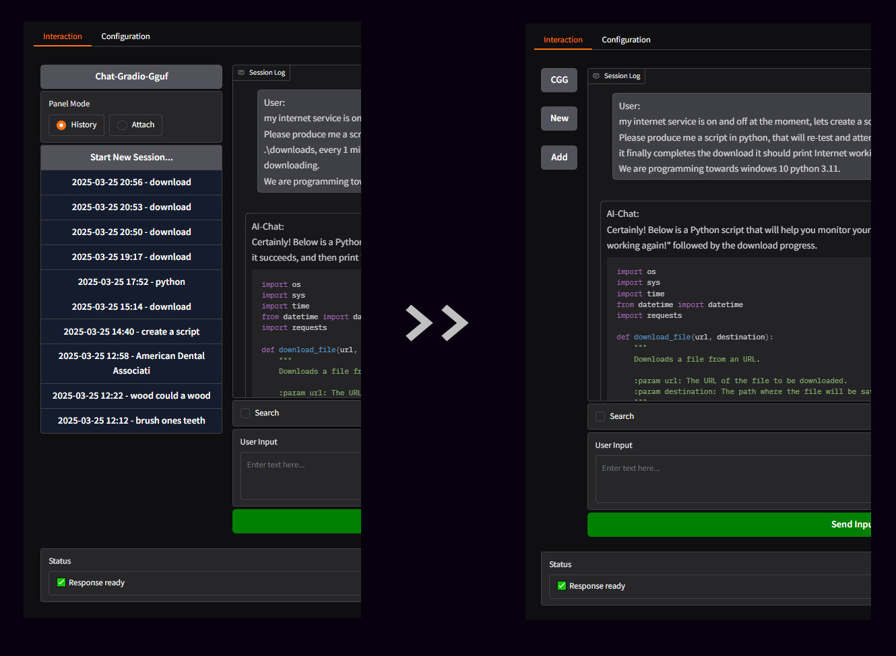
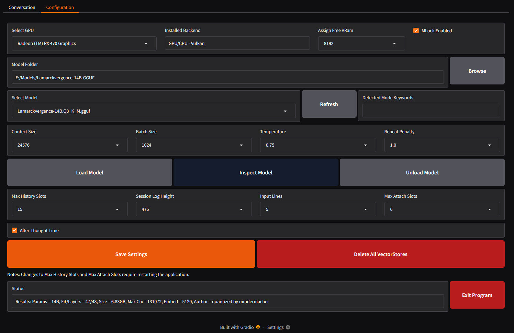

# Chat-Gradio-Gguf

<br>Status: Beta - See `Development` section..

## Description
Intended as a high-quality chat interface programmed towards windows 10 non-WSL, with any Cpu/Gpu on GGUF models. Dynamic prompting from keywords in models enabling better, interface and prompts, for relating theme of session, With some features but no imposed, limitations or guidelines. This tool providing local, uncensored, and inference with features that enhance productivity and usability, even a comparable interface, found on premium AI services, or as far in that direction as, Gradio and Grok3Beta and gguf models, will allow. The configuration is without options reported to make no difference on most models, ensuring a comprehensive yet streamlined experience.

### Features
- **Comprihensive CPU/GPU Support**: CPUs x64-CPU/AVX2/AVX512 and GPUs AMD/nVIDIA/Intel, with dropdown list selection supporting multi CPU/GPU setup.
- **Research-Grade Tools**: Includes RAG, web search, chunking, summarization, TOT, no-THINK, and code formatting, and with file attachments. 
- **Virtual Environment**: Isolated Python setup in `.venv` with `models` and `data` directories.
- **Common File Support**: Handles `.bat`, `.py`, `.ps1`, `.txt`, `.json`, `.yaml`, `.psd1`, `.xaml`, and other common formats of files.
- **Configurable Context**: Set model context to 8192-138072, and batch output to 1028-4096.
- **Enhanced Interface Controls**: Load/unload models, manage sessions, shutdown, and configure settings.
- **Highly Customizable UI**: Configurable; 10-20 Session History slots, 2-10 file slots, Session Log 400-550px height, 2-8 Lines of input. 
- **Afterthought Countdown**: If, <25 characters then 1s or 26-100 charactrs then 3s or >100 lines then 5s, cooldown before proceeding, enabling cancelation time relative to input size.
- **Speak Summaries**: Text to speak uses `PyWin32`.
- **Attach Files**: Attach Files is complete raw input, there is no Vectorise Files anymore, so the files should ideally be small enough to fit in context. 
- **Collapsable Left Column**: Like one would find on modern AI interface, but with concise 3 button interface for commonly used buttons. 
- **ASynchronous Response Stream**: Separate thread with its own event loop, allowing chunks of response queued/processed without blocking Gradio UI event loop.
- **Reasoning Compatible**: Dynamic prompt system adapts handling for reasoning models optimally, ie, uncensored, nsfw, chat, code.

### Preview
- The "Interaction" page, where the conversation happens...


- The collapseable Left Panel on the `Interaction` page...


- The "Configuration" page - for configuration of, models and hardware, and relevant components, as well as ui customization...


- Wide Llama.Cpp support in the installer...
```
========================================================================================================================
    Chat-Gradio-Gguf: Install Options
========================================================================================================================


 Select the Llama.Cpp type:

    1. AVX2 - CPU Only - Must be compatible with AVX2

    2. AVX512 - CPU Only - Must be compatible with AVX512

    3. NoAVX - CPU Only - For older CPUs without AVX support

    4. OpenBLAS - CPU Only - Optimized for linear algebra operations

    5. Vulkan - GPU/CPU - For AMD/nVidia/Intel GPU with x64 CPU

    6. Kompute - GPU/CPU - Experimental Vulkan with with CPU fallback

    7. CUDA 11.7 - GPU/CPU - For CUDA 11.7 GPUs with CPU fallback

    8. CUDA 12.4 - GPU/CPU - For CUDA 12.4 GPUs with CPU fallback


========================================================================================================================
 Selection; Menu Options = 1-8, Exit Installer = X:

```

## Requirements
- Windows 10/11 - Its a Windows program, it may be linux compatible later (not now).
- Llama.Cpp - Options here for, Avx2, Vulkan, Kompute, Cuda 11, Cuda 12.
- Python => 3.8 (tested on 3.11.0) - Libraries used = Gradio, LangChain, llama-cpp-python, FAISS.
- Llm Model - You will need a Large Language Model in GGUF format, See `Models` section.
- Suitable CPU/GPU - Gpu may be, Main or Compute, with VRam 2-64GB, testing on rx470 in Compute.  

### Instructions
1. Download a "Release" version, when its available, and unpack to a sensible directory, like, `C:\Program_Filez\Chat-Gradio-Gguf` or `C:\Programs\Chat-Gradio-Gguf`. 
2. Right click the file `Chat-Gradio-Gguf.bat`, and `Run as Admin`, the Batch Menu will then load, then select `2` from the Batch Menu, to begin installation. You will be prompted to select a Llama.Cpp version to install, which should be done based on your hardware. After which, the install will begin, wherein Python requirements will install to a `.\venv` folder. After the install completes, check for any install issues, you may need to install again if there are.
3. You will then be returned to the Batch Menu, where you, now and in future, select `1` to run to run `Chat-Gradio-Gguf`. You will then be greeted with the `Interaction` page, but you will first be going to the `Configuration` page. 
4. On the `Configuration` page you would configure appropriately, its all straight forwards, but remember to save settings and load model. If the model loads correctly it will say so in the `Status Bar` on the bottom od the display.
- VRAM dropdown, 1GB to 32GB in steps, this should be your FREE ram available on the selected card.
5. Go back to the `Interaction` page and begin interactions, ensuring to notice features available, and select appropriately for your, specific model and use cases.
6. When all is finished, click `Exit` on the bottom right and/or close browser-tabs/terminals, however you want to do it.

### Notation 
- We use a calculation of `1.125`, the calculation is `TotalVRam /((ModelFileSize * 1.125) / NumLayers = LayerSize) = NumLayersOnGpu`.
- For downloading large files such as LLM in GGUF format, then typically I would use  [DownLord](https://github.com/wiseman-timelord/DownLord), instead of lfs.
- This project is for a chat interface, and is not intended to overlap with my other projects, `Rpg-Gradio-Gguf`, or the blueprints for, `Code-Gradio-Gguf` or `Agent-Gradio-Gguf`.

### Model Label Keywords...
Keywords in model label will dynamically adapt the prompt appropriately...
- `Vanilla Chat` keywords - none of the below.
- `Coding` keywords - "code", "coder", "program", "dev", "copilot", "codex", "Python", "Powershell".
- `UnCensored` keywords - "uncensored", "unfiltered", "unbiased", "unlocked".
- `reasoning` keywords - "reason", "r1", "think".

## Models
You will of course need to have a `*.Gguf` model, here are some good ones at the time, with gpt for comparrisson..    
| Model                                  | IFEval   | BBH  /\  | MATH     | GPQA     | MuSR     | MMLU              | CO2 Cost  |
|----------------------------------------|----------|----------|----------|----------|----------|-------------------|-----------|
| T3Q-qwen2.5-14b-v1.0-e3 (14B)          | 73.24%   | 65.47%   | 28.63%   | 22.26%   | 38.69%   | 54.27%            | 1.56 kg   |
| calme-3.2-instruct-78b (78B)           | 80.63%   | 62.61%   | 40.33%   | 20.36%   | 38.53%   | 70.03%            | 66.01 kg  |
| Early GPT-4o                           | N/A      | ~60%*    | 52.9%*   | N/A      | N/A      | 87.5%*            | N/A       |
| qwen2.5-test-32b-it (32B)              | 78.89%   | 58.28%   | 59.74%   | 15.21%   | 19.13%   | 52.95%            | 29.54 kg  |
| Lamarckvergence-14B (14B)              | 76.56%   | 50.33%   | 54.00%   | 15.10%   | 16.34%   | 47.59% (MMLU-PRO) | N/A       |
| Early GPT-4                            | N/A      | ~50%*    | 42.2%    | N/A      | N/A      | 86.4%             | N/A       |
| Qwen2.5-Dyanka-7B-Preview (7B)         | 76.40%   | 36.62%   | 48.79%   | 8.95%    | 15.51%   | 37.51% (MMLU-PRO) | 0.62 kg   |
| qwen2.5-7b-cabs-v0.4 (7B)              | 75.83%   | 36.36%   | 48.39%   | 7.72%    | 15.17%   | 37.73% (MMLU-PRO) | N/A       |
| Q2.5-R1-3B (3B)                        | 42.14%   | 27.20%   | 26.74%   | 7.94%    | 12.73%   | 31.26% (MMLU-PRO) | N/A       |
<details>
  <summary>Click to expand</summary>
   
    Key...
    - IFEval (Instruction-Following Evaluation) - Measures how well an AI model understands and follows natural language instructions.
    - BBH (Big-Bench Hard) - A challenging benchmark testing advanced reasoning and language skills with difficult tasks.
    - MATH - Evaluates an AI model’s ability to solve mathematical problems, from basic to advanced levels.
    - GPQA (Graduate-Level Google-Proof Q&A) - Tests an AI’s ability to answer tough, graduate-level questions that require deep reasoning, not just web lookups.
    - MuSR (Multi-Step Reasoning) - Assesses an AI’s capability to handle tasks needing multiple logical or reasoning steps.
    - MMLU (Massive Multitask Language Understanding) - A broad test of general knowledge and understanding across 57 subjects, like STEM and humanities.
    - CO2 Cost - Quantifies the carbon dioxide emissions from training or running an AI model, reflecting its environmental impact.
    
    Here are some of the models detailed on the chart, verified working with Chat-Gradio-Gguf.. 
    1. For non-iMatrix 14B models...
    - [T3Q-qwen2.5-14b-v1.0-e3-GGUF](https://huggingface.co/mradermacher/T3Q-qwen2.5-14b-v1.0-e3-GGUF) - New Best ~14B model, 14th place overall. Its Qwen but seems to work with my program.
    - [Lamarckvergence-14B-GGUF](https://huggingface.co/mradermacher/Lamarckvergence-14B-GGUF) - Best ~14B model, ~65th overall beating most ~70B, tested and working.
    2. For non-iMatrix ~7B models...
    - Llama [DeepSeek-R1-Distill-Llama-8B-Uncensored-GGUF](https://huggingface.co/mradermacher/DeepSeek-R1-Distill-Llama-8B-Uncensored-GGUF) 8GB cutdown but somewhat compitent - Uncensored.
    - [Qwen2.5-Dyanka-7B-Preview-GGUF](https://huggingface.co/mradermacher/Qwen2.5-Dyanka-7B-Preview-GGUF)` - 7th best ~8b model, 455 overall.
    - [qwen2.5-7b-cabs-v0.4-GGUF](https://huggingface.co/mradermacher/qwen2.5-7b-cabs-v0.4-GGUF) - Supposedly one of the better ones, it did ok, not great.
    3. For fast non-iMatrix <3b models...
    - [Q2.5-R1-3B-GGUF](https://huggingface.co/mradermacher/Q2.5-R1-3B-GGUF) - Compitent but lacking frame of reference required for accuracy.
    - [DeepSeek-R1-Distill-Qwen-1.5B-uncensored-GGUF](https://huggingface.co/mradermacher/DeepSeek-R1-Distill-Qwen-1.5B-uncensored-GGUF) - Even faster, but unreliable.
    4. Models that are likely unsuitable, but, are noted for later use...
    - Instruct based models, such as [Nxcode-CQ-7B-orpol-Gguf](https://huggingface.co/tensorblock/Nxcode-CQ-7B-orpo-GGUF) and [Llama-3.2-3B-Instruct-uncensored-GGUF](https://huggingface.co/bartowski/Llama-3.2-3B-Instruct-uncensored-GGUF).
</details>

## File Structure
<details>
  <summary>Click to expand</summary>
    
    - Core Project files...
    project_root/
    │ Chat-Gradio-Gguf.bat
    │ requisites.py
    │ launcher.py
    ├── media/
    │ └── project_banner.jpg
    ├── scripts/
    │ └── interface.py
    │ └── models.py
    │ └── prompts.py
    │ └── settings.py
    │ └── temporary.py
    │ └── utlity.py
    - Installed/Temporary files...
    project_root/
    ├── data/
    │ └── persistence.json
    ├── data/vectors/
    └─────── *
    ├── data/temp/
    └────── *
    ├── data/history
    └────── *
    ├── .venv/
    └────── *
</details>

## Development
<details>
  <summary>Current</summary>

    1. Need to get streaming, sentence by sentence, working again, currently its word by word...is that ok? Whats with the buffer stuff in the terminal? Buffering each word? Need to also ensure output is standard in, answer section on reasoning model and normal output on normal model.
    2. when the `User Input` box is dynamically becoming larger, due to being filled with contents, then it seems to be become too large, and push input buttons off the page sometimes, so I want it so that for each 2 lines that the `User Input` box expands, then the Session Log height has 10px deducted, which will then move the `User Input` box up, so as to give the illusion, that the User input box expands both up and down at the same time. This will require optimal refresh of screen elements after the final height of the Session log is altered each time. Reason how to to it best and optimally. 
    3. Ensure, Testing and bugfixing, all features is done, and that everything is how is preferred..
    4. Complete Gen1.    
</details>
<details>
    <summary>Distant</summary>

    1. **Safe Globals** - Standardize all global variables using safe, unique three-word labels to avoid conflicts.  
    2. **Cross-Platform Scripting:** Introduce a unified script (`Chat-Gradio-Gguf.sh`) to support both Linux and Windows environments, and adapt scripts appropriately. 
    3. **User Interface and Notification Enhancements:**  
       - Implement verbose, clear, and concise printed notifications for all stages of model interaction (e.g., "Sending Prompt to Code Model...", "Response Received from Code Model...").   
       - maintain critical inclusion of Debug notification for terminal, as each are needed to be worked through.
</details>

## Credits
<details>
  <summary>Click to expand</summary>

    Thanks to all the following teams, for their parts...
    - [Llama.Cpp](https://github.com/ggml-org/llama.cpp) - Core library for interference with models.
    - [Yake](https://github.com/LIAAD/yake) - Library used for generating the labels for the history slots.
    - [Grok3Beta](https://x.com/i/grok) - For much of the complete updated functions that I implemented.
    - [Deepseek R1/3](https://www.deepseek.com/) - For re-attempting the things Grok3Beta was having difficulty with.
    - [Claude_Sonnet](https://claude.ai) - For a smaller amount of the work, if issue with the other services.
    - [Perplexity](https://www.perplexity.ai) - For circumstances of extensive web research requierd.
</details>

## License
This repository features **Wiseman-Timelord's Glorified License** in the file `.\Licence.txt`, in short, `if you wish to use most of the code, then you should fork` or `if you want to use a section of the code from one of the scripts, as an example, to make something work you mostly already have implemented, then go ahead`.

