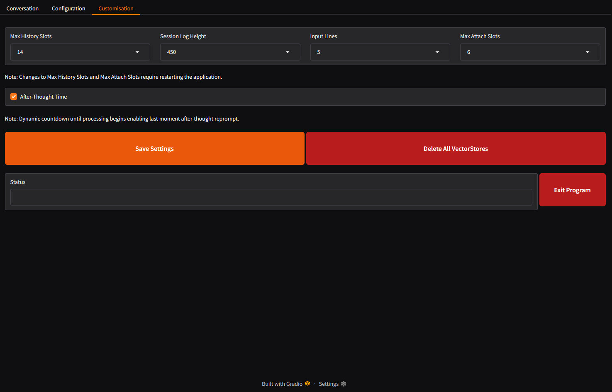

# Text-Gradio-Gguf
```
=======================================================================================================================
"                                  ___________      ________          ________                                        "
"                                  \__    ___/     /  _____/         /  _____/                                        "
"                                    |    | ______/   \  ___  ______/   \  ___                                        "
"                                    |    |/_____/\    \_\  \/_____/\    \_\  \                                       "
"                                    |____|        \______  /        \______  /                                       "
"                                                         \/                \/                                        "
-----------------------------------------------------------------------------------------------------------------------
```
Status: Beta - Testing and bugfixing.

## Description
A high-quality chat interface with uses include, Codeing, Rpg Game, Chat, with enhancements, for windows 10 with any GPU on GGUF models. Dynamic modes enabling correct, interface and prompts, for relating theme of sessions, With the latest advancements. This tool providing local, uncensored, and inference with features that enhance productivity and usability, even a comparable interface, found on premium AI services, or a far in that direction as Gradio will allow. The configuration is without options reported to make no difference on most models, ensuring a comprehensive yet streamlined experience. Capable of all things possible through simple scripts and awesome libraries and modern GGUF LLMs.

### Features
- **Operation Modes **:  "Auto" (filename keywords), "Chat", "Chat-Reasoning", "Chat-Uncensored", "Chat-Uncensored-Reasoning", "Chat-TOT", "Chat-Uncensored-TOT", "Coder", "Coder-Instruct", "Rpg", "Rpg-NSFW".
- **Comprihensive CPU/GPU Support**: CPUs x64-CPU/AVX2/AVX512 and GPUs AMD/nVIDIA/Intel, with dropdown list selection supporting multi CPU/GPU setup.
- **Research-Grade Tools**: Includes RAG, web search, chunking, summarization, and code formatting, and with configurable 2-12 file attachments. 
- **Virtual Environment**: Isolated Python setup in `.venv` with `models` and `data` directories.
- **Common File Support**: Handles `.bat`, `.py`, `.ps1`, `.txt`, `.json`, `.yaml`, `.psd1`, `.xaml`, and other common formats of files.
- **Configurable Context Window**: Set `n_ctx` to 8192, 16384, 24576, or 32768 via dropdown.
- **Enhanced Interface Controls**: Load/unload models, manage sessions, shutdown, and configure settings.
- **FAISS Vector Database**: Stores numerical vectors, and retrieves based on proximity in meaning, enabling pulling context from documents.
- **Session History Rotation**: Configurable 6-14 Session History slots on rotation, enabling load recent sessions, while not using excessive space. 
- **Afterthought Countdown**: If, =>10 lines then 5s or 5-10 lines then 3s or <5 lines then 1s, wait for you to cancel send and return to edit, saving on mis-prompts and waits.

### Preview
- The "Conversation" page, now the right panel toggles to Rpg options, if you are using Rpg mode...


- The "Configuration" page - for configuration of, models and hardware, and relevant components...


- The new "Customization" page - configuration of, UI and Program, elements, such as, history, databases, etc...


- Wide Llama.Cpp support in the installer, thanks to latest ~128k ai systems, no longer having to streamline such things...
```
========================================================================================================================
    Text-Gradio-Gguf: Install Options
========================================================================================================================


 Select the Llama.Cpp type:

    1. AVX2 - CPU Only - Must be compatible with AVX2

    2. AVX512 - CPU Only - Must be compatible with AVX512

    3. NoAVX - CPU Only - For older CPUs without AVX support

    4. OpenBLAS - CPU Only - Optimized for linear algebra operations

    5. Vulkan - GPU/CPU - For AMD/nVidia/Intel GPU with x64 CPU

    6. Kompute - GPU/CPU - Experimental Vulkan with with CPU fallback

    7. CUDA 11.7 - GPU/CPU - For CUDA 11.7 GPUs with CPU fallback

    8. CUDA 12.4 - GPU/CPU - For CUDA 12.4 GPUs with CPU fallback


========================================================================================================================
 Selection; Menu Options = 1-8, Exit Installer = X:

```

## Requirements
- Windows 10/11 - Its a Windows program, it may be linux compatible later (not now).
- Llama.Cpp - Options here for, Avx2, Vulkan, Kompute, Cuda 11, Cuda 12.
- Python => 3.8 (tested on 3.11.0) - Libraries used = Gradio, LangChain, llama-cpp-python, FAISS.
- Llm Model - You will need a Large Language Model in GGUF format, See below

### Instructions
1. Download a "Release" version, when its available, and unpack to a sensible directory, like, `C:\Program_Filez\Text-Gradio-Gguf` or `C:\Programs\Text-Gradio-Gguf`. 
2. Right click the file `Text-Gradio-Gguf.bat`, and `Run as Admin`, the Batch Menu will then load.
3. Select `2` from the Batch Menu, to begin installation.
4. you will be prompted to select a Llama.Cpp version to install, which should be done based on your hardware.
5. After which, the install will begin, wherein Python requirements will install to a `.\venv` folder.
6. After the install completes, check for any install issues, you may need to install again if there are.
7. You will then be returned to the Batch Menu, where you, now and in future, select `1` to run to run `Text-Gradio-Gguf`.
8. You will be greeted with the conversation page, but you will first be going to the configuration page.
9. On the `Configuration` page you would configure appropriately, its all straight forwards.
10. Go back to the `Conversation` page and begin interactions, ensuring to notice features available.

### Notation
- Tabs on left of `Chat` page; "Start New Session" at top, 10-session limit.
- Auto-labeled sessions (e.g., "Query about worms") stored in `.\data\history\*`.
- VRAM dropdown, 1GB to 32GB in steps, this should be your FREE ram available on the selected card.
- We use `(ModelFileSize * 1.1875) / NumLayers = LayerSize`, then `TotalVRam / LayerSize = NumLayersOnGpu`.
- Most GGUF text models will work, keep in mind the applicable keywords shown in `Model Label Keywords` section.
- For downloading large files such as LLM in GGUF format, then typically I would use  [DownLord](https://github.com/wiseman-timelord/DownLord), instead of lfs.

### Model label/name Keywords...
1. Keywords for Operation mode...
- `Coding` keywords - "code", "coder", "program", "dev", "copilot", "codex", "Python", "Powershell".
- `RPG Game` keywords - "nsfw", "adult", "mature", "explicit", "rp", "roleplay".
- `Chat` keywords - none of the above.
2. Keywords for Enhancements...
- `UnCensored` keywords - "uncensored", "unfiltered", "unbiased", "unlocked".
- `reasoning` keywords - "reason", "r1", "think".

# Models
You will of course need to have a `*.Gguf` model for anything to work, here are the models used to test the program.. 
1. For ~8B models (Primary/Quality).
- [qwen2.5-7b-cabs-v0.4-GGUF](https://huggingface.co/mradermacher/qwen2.5-7b-cabs-v0.4-GGUF) - Best <8b Model on General leaderboard, and ~500 overall.
- Choice between, Llama [DeepSeek-R1-Distill-Llama-8B-Uncensored-GGUF](https://huggingface.co/mradermacher/DeepSeek-R1-Distill-Llama-8B-Uncensored-GGUF) and Qwen [DeepSeek-R1-Distill-Qwen-7B-Uncensored-Reasoner-GGUF](https://huggingface.co/mradermacher/DeepSeek-R1-Distill-Qwen-7B-Uncensored-Reasoner-GGUF) , versions of R1 - Uncensored <8GB, Chat and Reasoning.
- [Nxcode-CQ-7B-orpol-Gguf](https://huggingface.co/tensorblock/Nxcode-CQ-7B-orpo-GGUF) - Best on Big code Leaderboard for Python, for Coder.
- [Ninja-v1-NSFW-RP-GGUF](https://huggingface.co/mradermacher/Ninja-v1-NSFW-RP-GGUF) - Most downloaded RP NSFW on huggingface at the time.
2. For <4B models (Secondary/Fast).
- [Llama-3.2-3B-Instruct-uncensored-GGUF](https://huggingface.co/bartowski/Llama-3.2-3B-Instruct-uncensored-GGUF) - untested.
- [DeepSeek-R1-Distill-Qwen-1.5B-uncensored-GGUF](https://huggingface.co/mradermacher/DeepSeek-R1-Distill-Qwen-1.5B-uncensored-GGUF) - Uncensored Reasoning.

## Development
- Currently doing a full test and bugfix, but the things below seem important too.
- Figure out if the Vector Databases apply to, session or mode, they should be per specific per session, which removes the need for the Delete Database buttons on the configuration page. Its important for one sessions, interactions and/or attached files, to NOT mix with other sessions...
```
                        erase_chat_btn = gr.Button("Erase Chat Data", variant="primary")
                        erase_rpg_btn = gr.Button("Erase RPG Data", variant="primary")
                        erase_code_btn = gr.Button("Erase Code Data", variant="primary")
                        erase_all_btn = gr.Button("Erase All Data", variant="primary")
```
- I want to be able to select the mode from the conversation page, `Chat`, `Coder`, `Rpg`, would display in the current `Operation Mode` box, and under it would be a slider with 3 positions. Thereabouts, removing code for detection of those 3 general modes.
- Tot for Code mode, so as to make it visible during code...
```
            if mode == "Code":
                tot_visible = True   # this line.
                web_visible = False
                file_visible = True
            elif mode == "Rpg":
                tot_visible = False
                web_visible = False
                file_visible = True
            else:  # Chat mode
                tot_visible = True
                web_visible = True
                file_visible = True
```
...if TOT is enable for code, then we would send the normal code prompt to the AI 3 times, then we would need a new prompt for assessment, as to which of the versions is the correct and best response, and it would judge all 3 of the generated responses, given criteria, among which are printing updates as complete updated functions without shortening of code, this would guarantee, that we would be able to tell the ai to create complete updated functions, but also the special prompt will also be doing debug etc to ensure it is correct with the context of the other scripts if they were attached, so some kind of ability to ensure to, be aware of and make use of the attached files.
- There are a lot of globals, ensure all globals are safe_three_word labels, so as, to not so much have a chance to interfere with other programs using the same globals.

## Far Development.
the next generation of the program will be ...
- attatched files should be able to be written to   
- 6 modes and dual model like this...
```
| **Mode**             | **Models**                     | **Features**                                      | **Implementation Notes**                                                                 |
|-----------------------|--------------------------------|--------------------------------------------------|-----------------------------------------------------------------------------------------|
| Chatbot              | Single chat model (e.g., DeepSeek-V3) | TOT reasoning, web research                     | Use LangChain for TOT (e.g., recursive prompt splitting), SerpAPI for web queries       |
| Advanced Chatbot     | Fast + Quality chat models    | TOT on Fast, AUTO/FAST/QUALITY switch, web on Fast | Quantize Fast model (e.g., 4-bit), add Gradio slider for mode, cache Quality outputs   |
| Coder                | Single code model (e.g., DeepSeek-Coder) | Syntax, formatting, completion                | Leverage Pygments for highlighting, integrate VSCode-like keybinds                     |
| Agentic Coder        | Code + text models            | Intent → code → review loop                    | Chain via LangChain agents, store intermediate states in .\data\                       |
| RPG Text             | Single RPG model              | Narrative, character tracking, uncensored       | Parse entities with regex, save JSON states in .\data\history\                         |
| RPG Text + Images    | RPG + image model (Flux.1-schnell) | Text RPG + scene images                      | Trigger Flux via llama.cpp image fork, display in Gradio gallery (256x256 max)         |
```
- Ideas for introduce a, `Chat-Persistent` and `Rpg-Persistent`, mode, where under that mode then it is not specific to the session, and by creating/loading a session, then it would look this up. This could be like lighter version of RPG with 1 AI character, and be like, `Counsellor` or `Girlfriend`, then someone could persistently chat, they cant because its on rotation, to there is a point to it.
- Introduction of `Text-Gradio-Gguf.sh` file and modifications of scripts, to enable, Linux AND Windows, support. 
- Verbose Clear Concise Printed Notifications for all stages of model interaction/json handling: `Sending Prompt to Code Model...`, `Generating Code for Chat Model...`, `Response Received from Code Model...`.
- Color themes. Deepseek R1 AND Grok3Beta, found this extremely difficult, Deepseek was better. It needs to be re-attempted later, possibly with GPT4o1. Make it all shades of grey, then allow people to choose the primary button color in configuration, or something simple like that.
- two new modes—Chat-Notate and Chat-Notate-Uncensored—to your Windows 10-based chatbot. These modes allow the AI to process uploaded PDFs into summarized notations, stored in .\data\notation, with two versions: a detailed summary (up to the model's context limit, minus a safety margin) and a concise summary (256 tokens). During chats, the AI selects the most relevant detailed notation based on user input to deliver informed responses. A Notation Library menu in the UI enables users to manage notations by indexing new PDFs or deleting existing ones. For reasoning models in these modes, the THINK phase is disabled (like in TOT mode), ensuring practical, notation-driven conversations. This feature is slated for a later development phase.


## Credits
- [X](https://x.com/) - [Grok](https://x.com/i/grok), at the time Grok3Beta. For much of the complete updated functions that I implemented.
- [Deepseek](https://www.deepseek.com/), at the time, 3 and R1. For re-attempting the things Grok3Beta was having difficulty with.

## License
**Wiseman-Timelord's Glorified License** is detailed in the file `.\Licence.txt`, that will later be added.

