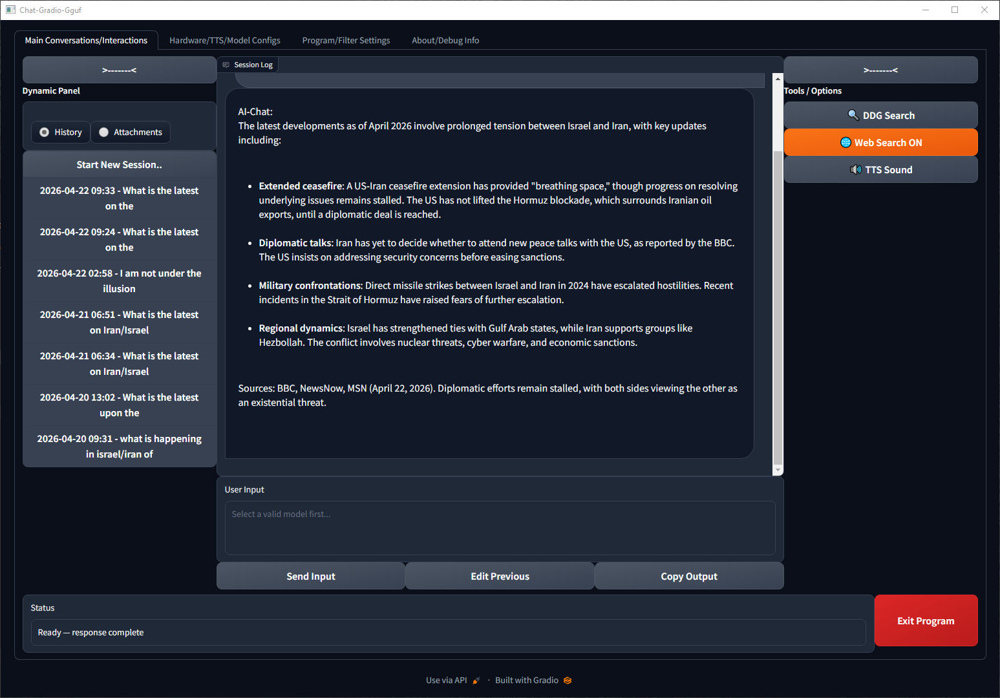
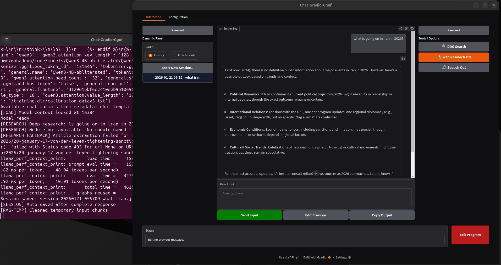
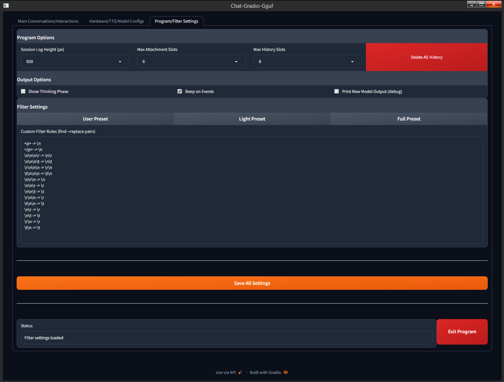
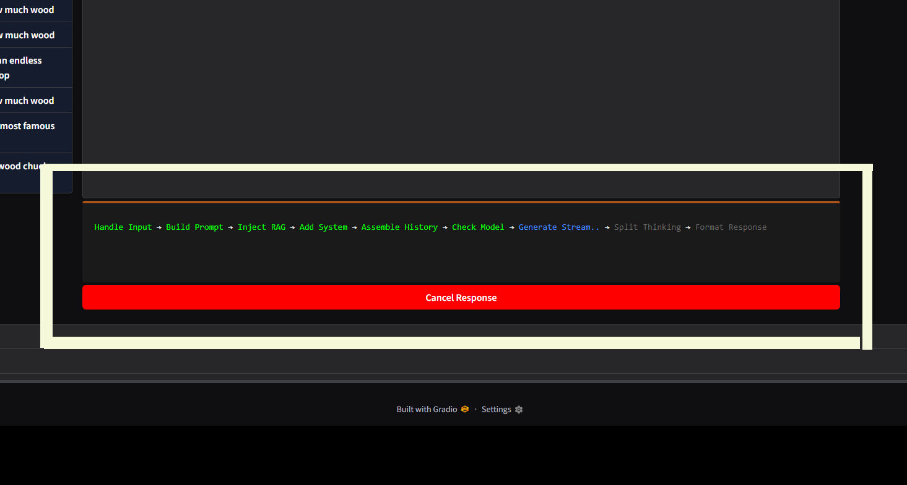

# 

### Status
Beta - Release version works (at least on Windows), but things are still being worked on. Current developments for next version are...
- Cleanup from overhaul from v1.02.0.
- Finalize things, mainly rename configuration.py to configure.py.
- Test and fix, on ubuntu 25.

## Description
Intended as a high-quality chat interface with wide hardware/os support, windows 7-11 (WSL not required) and Ubuntu 22-25, with any Gpu on GGUF models through Python ~3.9-3.13. An optimal number of features for a ChatBot, as well as, dynamic buttons/panels on the interface and websearch and RAG and TTS and archiving of sessions, and all on local models, so no imposed, limitations or guidelines (model dependent). This tool providing a comparable interface found on premium non-agentic AI services, where the configuration is intended to be intelligent, while without options reported in forums to make no difference on most models (no over-complication). The program using offline libraries (apart from websearch) instead of, online services or repeat download or registration. One thing to mention though, is that because a goal of the project is to make a Chatbot compatible as it is, therefore compromises had to be made, and it may not have all the latest versions of things, more the most widely compatible versions of things, so some features are not as good as they could be, but also, this program serves as a valuable reference for what needs to be used on what OS, albeit it, as a personal project it could be streamlined/enhanced/customized to your own likings later.   

### Core Principles
- This project is for a chat interface, and is not intended to overlap with other blueprints/projects, `Rpg-Gradio-Gguf` or `Code-Gradio-Gguf` or `Agent-Gradio-Gguf`. 
- A, Windows 7-11 and Ubuntu 22-25, compatibility range; though Ubuntu 25 users have limitations I believe already due to python 3.13. Any and all compatibility issues within those ranges MUST be overcome.
- This Program is also intended to have only basic tools of, DDG Search, Web Search, and Speech Out. The cost of having wide compatibility is scrifice of tool complexity.
- I am not making this program for ME, its for the community, so that people on OS people should be using, that is Ubuntu and Windows, are able to use AI, even on legacy setups or banger laptops.

### Features
- **Qt-Web Custom Browser**: The interface uses Qt-Web with Gradio, it appears as a regular application, and means your default browser are untouched.  
- **Comprihensive GPU Support**: Vulkan, with dropdown list in configuration selection supporting multi CPU/GPU setup.
- **Research-Grade Tools**: Includes RAG, web search, chunking, THINK, and Markdown formatting, and file attachments. 
- **Common File Support**: Handles `.bat`, `.py`, `.ps1`, `.txt`, `.json`, `.yaml`, `.psd1`, `.xaml`, and other common formats of files.
- **Configurable Context**: Set model context to 8192-138072, and batch output to 256-8192.
- **Enhanced Interface Controls**: Load/unload models, manage sessions, shutdown, and configure settings.
- **Highly Customizable UI**: Configurable; 4-16 Session History slots, 2-10 file slots, Session Log 450-1300px height, 2-8 Lines of input. 
- **Speak Summaries**: Click `Speech` for a special prompt for a concise spoken summary of the generated output. Text to speak uses `PyWin32`.
- **Attach Files**: Attach Files is complete raw input, there is no Vectorise Files anymore, so the files should ideally be small enough to fit in context. 
- **Collapsable Left/Right Column**: Like one would find on modern AI interface, and with concise collapsed view interface for commonly used buttons. 
- **ASynchronous Response Stream**: Separate thread with its own event loop, allowing chunks of response queued/processed without blocking Gradio UI event loop.
- **Reasoning Compatible**: Dynamic prompt system adapts handling for reasoning models optimally, ie, uncensored, nsfw, chat, code.
- **Virtual Environment**: Isolated Python setup in `.venv` with `models` and `data` directories.
- **Fast and Optimised**: Optionally compiling Vulkan backend/wheel with special AVX/FMA/F16C optimisations, as well as runtime optimizations for vulkan.

### Preview
- The Interaction page on Windows, showing the new 3 tab design, with Command Prompt in the background (v1.02.0)...


- The Interaction page on Ubuntu, here showing the non-working search function, with Ubuntu Terminal in the background (before v0.99.8)...


- The Configuration page, for configuration of, models, hardware, GUI, and other settings...


- The Filtering page, for configuration of model output filter settings...


- The collapseable Left/Right Panel on the Interaction page (click the `<->` button)...


- The dynamic progress indication replaces the user input box upon submission...


- Startup looks like this in the terminal/console (ignore warnings) (v0.98.2)...
<details>
    
    ===============================================================================
        Chat-Gradio-Gguf: Launcher
    ===============================================================================
    
    Starting Chat-Gradio-Gguf...
    Activated: `.venv`
    C:\LocalAI_Files\Chat-Gradio-Gguf\Chat-Gradio-Gguf-0.98.1_r2\.venv\Lib\site-pack
    ages\transformers\utils\hub.py:124: FutureWarning: Using `TRANSFORMERS_CACHE` is
     deprecated and will be removed in v5 of Transformers. Use `HF_HOME` instead.
      warnings.warn(
    `main` Function Started.
    [INI] Platform: windows
    [INI] Backend: VULKAN_CPU
    [INI] Vulkan: True
    [INI] Embedding Model: BAAI/bge-small-en-v1.5
    [INI] Embedding Backend: sentence_transformers
    [INI] Llama CLI Path: data/llama-vulkan-bin/llama-cli.exe
    [INI] Llama Bin Path: data/llama-vulkan-bin
    [INI] OS Version: 8.1
    [INI] Windows Version: 8.1
    [CONFIG] Model folder: F:/LargeModels/Size_Little_3b-4b/Qwen3-4B-abliterated-GGU
    F
    [CONFIG] Context: 8192, VRAM: 8192MB, Temp: 0.66
    [CONFIG] Layer allocation: VRAM_SRAM
    [CONFIG] UI: History=12, Attach=6, Height=1000
    [CONFIG] SELECTED_GPU: Radeon (TM) RX 470 Graphics
    [CONFIG] SELECTED_CPU: AMD Ryzen 9 3900X 12-Core Processor (12 cores, 24 threads
    )
    [CONFIG] MMAP: True
    [CONFIG] MLOCK: False
    [CONFIG] BATCH_SIZE: 1024
    [CONFIG] DYNAMIC_GPU_LAYERS: True
    [MODELS] Scanning directory: ...\Size_Little_3b-4b\Qwen3-4B-abliterated-GGUF
    [MODELS] V Found 1 models:
    [MODELS]   - Qwen3-4B-abliterated-q6_k_m.gguf
    [CONFIG] Found 1 models in F:/LargeModels/Size_Little_3b-4b/Qwen3-4B-abliterated
    -GGUF
    [CONFIG] Saved model name: Qwen3-4B-abliterated-q6_k_m.gguf
    [CONFIG] Model 'Qwen3-4B-abliterated-q6_k_m.gguf' found and selected
    Configuration loaded
    [CONFIG] ==================== Load Complete ====================
    [Vulkan] GGML_CUDA_NO_PINNED=1   (frees ~300 MB VRAM)
    [Vulkan] GGML_VK_NO_PIPELINE_CACHE=0  (cached SPIR-V pipelines)
    Script mode `windows` with backend `VULKAN_CPU`
    Working directory: ...\Chat-Gradio-Gguf\Chat-Gradio-Gguf-0.98.1_r2
    Data Directory: ...-Gradio-Gguf\Chat-Gradio-Gguf-0.98.1_r2\data
    Session History: ...Gguf\Chat-Gradio-Gguf-0.98.1_r2\data\history
    Temp Directory: ...io-Gguf\Chat-Gradio-Gguf-0.98.1_r2\data\temp
    [CPU] Detected: 12 cores, 24 threads
    [CPU] Current: 20
    CPU Configuration: 12 physical cores, 24 logical cores
    
    Configuration:
      Backend: VULKAN_CPU
      Model: Qwen3-4B-abliterated-q6_k_m.gguf
      Context Size: 8192
      VRAM Allocation: 8192 MB
      CPU Threads: 20
      GPU Layers: 0
    
    [INIT] Pre-loading auxiliary models...
    [INIT] OK spaCy model pre-loaded
    [RAG] Cache directory: C:\LocalAI_Files\Chat-Gradio-Gguf\Chat-Gradio-Gguf-0.98.1
    _r2\data\embedding_cache
    [RAG] Attempting to load (offline): BAAI/bge-small-en-v1.5
    C:\LocalAI_Files\Chat-Gradio-Gguf\Chat-Gradio-Gguf-0.98.1_r2\.venv\Lib\site-pack
    ages\huggingface_hub\file_download.py:942: FutureWarning: `resume_download` is d
    eprecated and will be removed in version 1.0.0. Downloads always resume when pos
    sible. If you want to force a new download, use `force_download=True`.
      warnings.warn(
    [RAG] Successfully loaded: BAAI/bge-small-en-v1.5
    [INIT] OK Embedding model pre-loaded from cache
    
    Launching Gradio Interface...
    [BROWSER] Starting Gradio server in background...
    [BROWSER] Waiting for Gradio server at http://localhost:7860...
    Running on local URL:  http://localhost:7860
    
    To create a public link, set `share=True` in `launch()`.
    IMPORTANT: You are using gradio version 3.50.2, however version 4.44.1 is availa
    ble, please upgrade.
    --------
    [BROWSER] Gradio server is ready
    [BROWSER] Launching at http://localhost:7860/?__theme=dark
    [BROWSER] Platform: windows, Windows Version: 8.1
    [BROWSER] Windows 8.1 detected - using Qt5 WebEngine
    [BROWSER] Loading URL: http://localhost:7860/?__theme=dark
    [BROWSER] Qt5 WebEngine window created
    Updating model list with new_dir: F:/LargeModels/Size_Little_3b-4b/Qwen3-4B-abli
    terated-GGUF
    [MODELS] Scanning directory: ...\Size_Little_3b-4b\Qwen3-4B-abliterated-GGUF
    [MODELS] V Found 1 models:
    [MODELS]   - Qwen3-4B-abliterated-q6_k_m.gguf
    Choices returned: ['Qwen3-4B-abliterated-q6_k_m.gguf'], Setting value to: Qwen3-
    4B-abliterated-q6_k_m.gguf

</details>

- The combined Info/Install menu  (v0.99.4)...
<details>
    
    ===============================================================================
        Chat-Gradio-Gguf - Configure Installation
    ===============================================================================
    
    System Detections...
        CPU Features: AVX, AVX2, FMA, F16C, SSE3, SSSE3, SSE4_1, SSE4_2
        Operating System: Windows 8.1
        Optimal Python: 3.11; Vulkan Present: Yes
        Build Tools: Git, CMake, MSVC, MSBuild
    
    Backend Options...
       1) Download CPU Wheel / Default CPU Wheel
       2) Download Vulkan Bin / Default CPU Wheel
       3) Compile CPU Binaries / Compile CPU Wheel
       4) Compile Vulkan Binaries / Compile Vulkan Wheel
    
    Embedding Model...
       a) Bge-Small-En v1.5 (Fastest - 132MB)
       b) Bge-Base-En v1.5 (Regular - 425MB)
       c) Bge-Large-En v1.5 (Quality - 1.35GB)
    
    TTS Options...
       d) American Accent
       e) English Accent
       f) Robot Accent (Smaller Install)
    
    ===============================================================================
    Selection; Backend=1-4, Embed=a-c, TTS=d/e/f, Abandon=A; (e.g. 2be):

</details>

- Installation for option 2b on Windows 8.1 (v1.00.00-b)..
<details>
    
    ===============================================================================
        Chat-Gradio-Gguf - Installation
    ===============================================================================
    
    Installing Chat-Gradio-Gguf on Windows 8.1 with Python 3.11
      Route: Download Vulkan Bin / Default CPU Wheel
      Llama.Cpp b7688, Gradio 3.50.2, Qt-Web v5
    Embedding model: BAAI/bge-base-en-v1.5
    [V] Verified directory: data
    [V] Verified directory: scripts
    [V] Verified directory: models
    [V] Verified directory: data/history
    [V] Verified directory: data/temp
    [V] Verified directory: data/vectors
    [V] Verified directory: data/embedding_cache
    [V] Using project temp path: C:\LocalAI_Files\Chat-Gradio-Gguf\Chat-Gradio-Gguf-
    1.00.0\data\temp
    [V] System information file created
    [V] Installing Python dependencies...
    [V] Installing base packages (Gradio 3.50.2)...
      [1/20] Installing numpy<2... OK
      [2/20] Installing requests... OK
      [3/20] Installing pyperclip... OK
      [4/20] Installing spacy... OK
      [5/20] Installing psutil... OK
      [6/20] Installing ddgs... OK
      [7/20] Installing langchain-community... OK
      [8/20] Installing faiss-cpu... OK
      [9/20] Installing langchain... OK
      [10/20] Installing pygments... OK
      [11/20] Installing lxml... OK
      [12/20] Installing lxml_html_clean... OK
      [13/20] Installing tokenizers... OK
      [14/20] Installing beautifulsoup4... OK
      [15/20] Installing aiohttp... OK
      [16/20] Installing pywin32... OK
      [17/20] Installing tk... OK
      [18/20] Installing pythonnet... OK
      [19/20] Installing newspaper4k... OK
      [20/20] Installing gradio... OK
    [V] Base packages installed
    [V] Installing embedding backend (torch + sentence-transformers)...
    [V] Installing PyTorch 2.2.2 (CPU-only) for Python 3.11...
    [V] PyTorch 2.2.2 (CPU) installed
    [V] Installing transformers==4.41.2...
    [V] transformers installed
    [V] Installing sentence-transformers==3.0.1...
    [V] sentence-transformers installed
    [V] Embedding backend verified
    [V] Installing Qt WebEngine for custom browser...
    [V] Windows 8.1 - installing PyQt5 + Qt5 WebEngine...
    [V] Qt5 WebEngine installed
    [V] Installing pre-built llama-cpp-python (CPU)...
    [V] Pre-built wheel installed
    [V] Python dependencies installed successfully
    [V] Installing optional file format support...
    [V]   Installed PyPDF2
    [V]   Installed python-docx
    [V]   Installed openpyxl
    [V]   Installed python-pptx
    [V] Initializing embedding cache for BAAI/bge-base-en-v1.5...
    Embedding Initialization Output...
        Importing torch...
        torch version: 2.2.2+cpu
        CUDA available: False (should be False)
        Importing sentence_transformers...
        Loading model: BAAI/bge-base-en-v1.5
        Testing embedding...
        SUCCESS: Model loaded, dimension: 768
    [V] Embedding cache initialized
    [V] Downloading spaCy language model...
    Downloading spaCy model: [==============================] 100% (12.2MB/12.2MB) -
     Complete
    [V] Installing spaCy model...
    [V] spaCy model installed
    [V] Downloading backend binaries...
    Downloading backend: [==============================] 100% (36.4MB/36.4MB) - Com
    plete
    [V] Extracting backend...
    Extracting: [=========================] 100% (43.0B/43.0B)
    [V] Backend ready
    [V] Configuration file created
    [V] Installation complete!
    
    Run the launcher to start Chat-Gradio-Gguf
    
    [V] Cleaned up compilation temp folder
    DeActivated: `.venv`
    Press any key to continue . . .

</details>

- Installation for option 2ag on Ubuntu 25 (v0.99.3)..
<details>
    
    ===============================================================================
        Chat-Gradio-Gguf - Installation
    ===============================================================================
    
    Installing Chat-Gradio-Gguf on Ubuntu 25.04 with Python 3.13
      Route: Download Vulkan Bin / Default CPU Wheel
      Llama.Cpp b7688, Gradio 5.49.1, Qt-Web v6, TTS pyttsx3
    Embedding model: BAAI/bge-small-en-v1.5
    [✓] Verified directory: data
    [✓] Verified directory: scripts
    [✓] Verified directory: models
    [✓] Verified directory: data/history
    [✓] Verified directory: data/temp
    [✓] Verified directory: data/vectors
    [✓] Verified directory: data/embedding_cache
    [✓] Using project temp path: /home/mastar/Programs/Chat-Gradio-Gguf/Chat-Gradio-Gguf-0.99.2/data/temp
    [✓] System information file created
    [✓] Installing Linux system dependencies...
    Hit:1 https://developer.download.nvidia.com/compute/cuda/repos/ubuntu2404/x86_64  InRelease
    Hit:2 http://security.ubuntu.com/ubuntu plucky-security InRelease
    Hit:3 http://gb.archive.ubuntu.com/ubuntu plucky InRelease
    Hit:4 http://gb.archive.ubuntu.com/ubuntu plucky-updates InRelease
    Hit:5 http://gb.archive.ubuntu.com/ubuntu plucky-backports InRelease
    Reading package lists... Done
    Reading package lists... Done
    Building dependency tree... Done
    Reading state information... Done
    libegl1 is already the newest version (1.7.0-1build1).
    libffi-dev is already the newest version (3.4.7-1).
    libssl-dev is already the newest version (3.4.1-1ubuntu4).
    build-essential is already the newest version (12.12ubuntu1).
    python3-dev is already the newest version (3.13.3-1).
    portaudio19-dev is already the newest version (19.6.0-1.2build3).
    libgl1 is already the newest version (1.7.0-1build1).
    libxkbcommon0 is already the newest version (1.7.0-2).
    libxcb-cursor0 is already the newest version (0.1.5-1).
    espeak-ng is already the newest version (1.52.0+dfsg-4).
    libespeak-ng1 is already the newest version (1.52.0+dfsg-4).
    xvfb is already the newest version (2:21.1.16-1ubuntu1.2).
    Solving dependencies... Done
    The following packages were automatically installed and are no longer required:
      linux-headers-6.14.0-23 linux-headers-6.14.0-23-generic
      linux-image-6.14.0-23-generic linux-modules-6.14.0-23-generic
      linux-modules-extra-6.14.0-23-generic
      linux-modules-nvidia-570-6.14.0-23-generic
      linux-objects-nvidia-570-6.14.0-23-generic
      linux-signatures-nvidia-6.14.0-23-generic linux-tools-6.14.0-23
      linux-tools-6.14.0-23-generic
    Use 'sudo apt autoremove' to remove them.
    0 upgraded, 0 newly installed, 0 to remove and 347 not upgraded.
    [✓] Base dependencies installed
    [✓] Installing Qt6 dependencies...
    [✓]   Installed libxcb-cursor0
    [✓]   Installed libxkbcommon0
    [✓]   Installed libegl1
    [✓]   Installed libgl1
    [✓]   Installed libxcb-xinerama0
    [✓]   Installed qt6-base-dev
    [✓]   Installed libqt6webenginecore6
    [✓]   Installed libqt6webenginewidgets6
    [✓] Installing Vulkan development packages...
    Reading package lists... Done
    Building dependency tree... Done
    Reading state information... Done
    vulkan-tools is already the newest version (1.4.304.0+dfsg1-1).
    Solving dependencies... Done
    The following packages were automatically installed and are no longer required:
      linux-headers-6.14.0-23 linux-headers-6.14.0-23-generic
      linux-image-6.14.0-23-generic linux-modules-6.14.0-23-generic
      linux-modules-extra-6.14.0-23-generic
      linux-modules-nvidia-570-6.14.0-23-generic
      linux-objects-nvidia-570-6.14.0-23-generic
      linux-signatures-nvidia-6.14.0-23-generic linux-tools-6.14.0-23
      linux-tools-6.14.0-23-generic
    Use 'sudo apt autoremove' to remove them.
    0 upgraded, 0 newly installed, 0 to remove and 347 not upgraded.
    [✓]   Installed vulkan-tools
    Reading package lists... Done
    Building dependency tree... Done
    Reading state information... Done
    libvulkan1 is already the newest version (1.4.304.0-1).
    Solving dependencies... Done
    The following packages were automatically installed and are no longer required:
      linux-headers-6.14.0-23 linux-headers-6.14.0-23-generic
      linux-image-6.14.0-23-generic linux-modules-6.14.0-23-generic
      linux-modules-extra-6.14.0-23-generic
      linux-modules-nvidia-570-6.14.0-23-generic
      linux-objects-nvidia-570-6.14.0-23-generic
      linux-signatures-nvidia-6.14.0-23-generic linux-tools-6.14.0-23
      linux-tools-6.14.0-23-generic
    Use 'sudo apt autoremove' to remove them.
    0 upgraded, 0 newly installed, 0 to remove and 347 not upgraded.
    [✓]   Installed libvulkan1
    [✓] Linux dependencies installed
    [✓] Installing Python dependencies...
    [✓] Installing base packages (Gradio 5.49.1)...
      [1/19] Installing numpy<2... OK
      [2/19] Installing requests... OK
      [3/19] Installing pyperclip... OK
      [4/19] Installing spacy... OK
      [5/19] Installing psutil... OK
      [6/19] Installing ddgs... OK
      [7/19] Installing langchain-community... OK
      [8/19] Installing faiss-cpu... OK
      [9/19] Installing langchain... OK
      [10/19] Installing pygments... OK
      [11/19] Installing lxml... OK
      [12/19] Installing lxml_html_clean... OK
      [13/19] Installing pyttsx3... OK
      [14/19] Installing tokenizers... OK
      [15/19] Installing beautifulsoup4... OK
      [16/19] Installing aiohttp... OK
      [17/19] Installing pyvirtualdisplay... OK
      [18/19] Installing newspaper4k... OK
      [19/19] Installing gradio... OK
    [✓] Base packages installed
    [✓] Installing embedding backend (torch + sentence-transformers)...
    [✓] Installing PyTorch 2.4+ (CPU-only) for Python 3.13...
    [✓] PyTorch 2.4+ (CPU) installed
    [✓] Installing transformers>=4.42.0...
    [✓] transformers installed
    [✓] Installing sentence-transformers>=3.0.0...
    [✓] sentence-transformers installed
    [✓] Embedding backend verified
    [✓] Installing Qt WebEngine for custom browser...
    [✓] Ubuntu 25.04 - installing PyQt6 + Qt6 WebEngine...
    [✓] Qt6 WebEngine installed
    [✓] Installing pre-built llama-cpp-python (CPU)...
    [✓] Pre-built wheel installed
    [✓] Python dependencies installed successfully
    [✓] Installing optional file format support...
    [✓]   Installed PyPDF2
    [✓]   Installed python-docx
    [✓]   Installed openpyxl
    [✓]   Installed python-pptx
    [✓] Initializing embedding cache for BAAI/bge-small-en-v1.5...
    Embedding Initialization Output...
        Importing torch...
        torch version: 2.10.0+cpu
        CUDA available: False (should be False)
        Importing sentence_transformers...
        Loading model: BAAI/bge-small-en-v1.5
        Testing embedding...
        SUCCESS: Model loaded, dimension: 384
    [✓] Embedding cache initialized
    [✓] Downloading spaCy language model...
    Downloading spaCy model: [==============================] 100% (12.2MB/12.2MB) - Complete
    [✓] Installing spaCy model...
    [✓] spaCy model installed
    [✓] Installing pyttsx3 TTS (system voices)...
    [✓] pyttsx3 TTS ready (system voices)
    [✓] Updated constants.ini with TTS engine: pyttsx3
    [✓] Downloading backend binaries...
    Downloading backend: [==============================] 100% (36.0MB/36.0MB) - Complete
    [✓] Extracting backend...
    Extracting: [=========================] 100% (51.0B/51.0B)
    [✓] Copied 50 binary files
    [✓] Backend ready
    [✓] Configuration file created
    [✓] Installation complete!
    
    Run the launcher to start Chat-Gradio-Gguf
    
    Deactivated: .venv
    Press Enter to continue...

</details>

- Validation of Installation (v1.00.0)..
<details>
    
    ===============================================================================
        Chat-Gradio-Gguf: Library Validation
    ===============================================================================
    
    Running Library Validation...
    Activated: `.venv`
    ==================================================
      Chat-Gradio-Gguf Validator (WINDOWS)
    ==================================================
    
    System: windows 8.1
    Python: 3.11.0
    Backend: VULKAN_CPU
    Embedding: BAAI/bge-base-en-v1.5
    Gradio: 3.50.2, Qt: 5
    
    === Directory Validation ===
      V data
      V scripts
      V models
      V data/history
      V data/temp
      V data/vectors
      V data/embedding_cache
    
    === Script Files Validation ===
      V browser.py
      V interface.py
      V models.py
      V prompts.py
      V settings.py
      V temporary.py
      V utility.py
    
    === Configuration Validation ===
      V constants.ini valid (Backend: VULKAN_CPU)
      V persistent.json valid
    
    === Virtual Environment Validation ===
      V Virtual environment OK
    
    === Backend Binary Validation ===
      V llama-cli found: llama-cli.exe
    
    === Core Library Validation ===
      V gradio
      V numpy
      V requests
      V pyperclip
      V spacy
      V psutil
      V ddgs
      V langchain-community
      V faiss-cpu
      V langchain
      V pygments
      V lxml
      V lxml_html_clean
      V tokenizers
      V beautifulsoup4
      V aiohttp
      V py-cpuinfo
      V sentence-transformers
      V torch
      V transformers
      V llama-cpp-python
      V newspaper4k
      V pywin32
      V tk
      V pythonnet
    
    === Optional Library Validation ===
      V PyPDF2 (optional)
      V python-docx (optional)
      V openpyxl (optional)
      V python-pptx (optional)
    
    === spaCy Model Validation ===
      V en_core_web_sm model available
    
    === Embedding Model Validation ===
      V Embedding model verified (BAAI/bge-base-en-v1.5)
    
    === Gradio & Custom Browser Check ===
      Expected: Gradio 3.50.2, PyQt5 WebEngine
      V Gradio import OK
      V PyQt5 WebEngine import OK
    
    ==================================================
      Validation Summary
    ==================================================
      directories: V PASS
      scripts: V PASS
      config: V PASS
      venv: V PASS
      llama_cli: V PASS
      core_libs: V PASS
      spacy: V PASS
      embedding: V PASS
      browser: V PASS
    
      Result: 9/9 checks passed
      V
    All validations passed!
    
    Press Enter to exit...
        
</details>

## Hard Requirements
- Windows 7-11 and/or ~Ubuntu 22-25 - Its BOTH a, Windows AND linux, program, batch for windows and bash for linux, launch dual-mode scripts.
- Python 3.9-3.13 - Requires [Python](https://www.python.org); AI warns me certain libraries wont work on Python 3.14, possibly Spacy. 
- Llm Model - You will need a Large Language Model in GGUF format, check the models section for recommendations, but for quick start I advise one like [Qwen3-4B-abliterated-GGUF](https://huggingface.co/mradermacher/Qwen3-4B-abliterated-GGUF) for testing basic operation.
- Suitable GPU - Gpu may be, Main or Compute, with VRam selection 4GB-64GB. It must have Vulkan capability/drivers. Ideally you want the GPU to cover all model layers for fast interference.
- System Ram - Your system ram must cover, the curren load and the size of the model layers not able to be covered by the GPU, plus smaller models like the embeddings model, plus the wheel if not built for Vulkan.

### Graphics Requirements
GPU interference is done through (have a guess) Vulkan...
- Vulkan - For vulkan install options you must install the [Vulkan SDK](https://vulkan.lunarg.com/sdk/home).

### Building Requirements 
For compile options; If on PATH, ask AI how to check its on path, and as applicable fix...
- MSVC 2017-2019 - MSVC with option, Desktop Development and CMake, enabled during install.
- MS Build Tools - Also for building, ensure its on PATH.
- Git - Github Program for cloning the sources from github, ensure its on PATH.
- Vulkan SDK - Cant remember but possibly need the Vulkan SDK to build for Vulkan.

### Instructions (W = Windows, U = Ubuntu)...
- Installation...
```
1.W. Download a "Release" version, when its available, and unpack to a sensible directory, such as, `C:\Programs\Chat-Windows-Gguf` or `C:\Program_Files\Chat-Windows-Gguf`, (better not to use spaces with python projects). 
1.U. Download a "Release" version, when its available, and unpack to a sensible directory, such as, `/media/**User_Name**/**Drive_Name**/Programs/Chat-Gradio-Gguf`, (better not to use spaces with python projects).
2.W. Right click the file `Chat-Windows-Gguf.bat`, and `Run as Admin`, the Batch Menu will then load, then select `2` from the Batch Menu, to begin installation. You will be prompted to select a Llama.Cpp version to install, which should be done based on your hardware. After which, the install will begin, wherein Python requirements will install to a `.\venv` folder. 
2.U. open a terminal in the created folder location, then make "Chat-Gradio-Gguf.sh" executable via `Right Mouse>Properties>Make Executable`. Then run `sudo bash ./Chat-Linux-Gguf.sh`, then select option `2. Run Installation` from the menu.
- There are now 4 install options, mainly download, only or compile, and, cpu or gpu; If you do NOT have the 3 build apps installed then select 1/2, if you do SO have build apps installed then select 3/4. 
- The embedding model is the bit between your input and the model, larger is slower/quality obviously, and note its loaded only to system ram, because its ONNX. 
4. After the install completes, check for any install issues in the output, you may need to, check network or reinstall again, if there are issues. Pressing Enter will return you to the Batch Menu.
```
- Running...
```
1. Having, returned to or run, the bash/batch menu, at some point after having run a successful install, one would use option `1. Run Main Program`, to load the gradio interface in the popup browser window. You will then be greeted with the `Interaction` page.
- You may, click maximise or drag to the side of the screen, to re-position window, as well as, press CTRL + WheelUp/WheelDown to resize the interface to your display size.
2. Yous should click the `Configuration` tab. On the `Configuration` page you would configure appropriately, its all straight forwards, but, take your time and remember to save settings, and then load model. If the model loads correctly it will say so in the `Status Bar` on the bottom od the display. On Ubuntu if your default sound card is not in the list, then you should ensure to set the Sound Card.
3. Go back to the `Interaction` page and begin interactions, ensuring to notice tool options available, and select appropriately for your intended use, then type your input into the User Input box, and then click Send Input.
4. When all is finished, click `Exit` on the bottom right, then you are left with the terminal menu, where you type `x` to exit.
```

### Useful Info
- Internet research Tools (v0.99.6+)...
```
DDG Search = Faster DuckDuckGo research.
Web Search = Slower actual website reading research. 
```
- Research scaled to Context Length...
```
| Context | Multiplier | DDG Results | DDG Deep | Web Results | Web Deep |
|---------|------------|-------------|----------|-------------|----------|
| 16384   | 0.5x       | 4           | 2        | 6           | 3        |
| 32768   | 1.0x       | 8           | 4        | 12          | 6        |
| 65536   | 2.0x       | 16          | 8        | 24          | 12       |
| 131072  | 4.0x       | 32          | 16       | 48          | 24       |
```

### Notation 
- Because of how the WT-Web interface works, there is ongoing issue with how sometimes lists of values in the configuration page are non-selectable; just select a different number in list first, then select number you want. Only way to fix this would be to drop older windows/ubuntu support.  
- The "Cancel Input/Response" button was impossible for now; Attempted most recently, 2 Opus 4.5 and 2 Grok, sessions, and added about ~=>45k, but then required, "Wait For Response" for Gradio v3 and Cancel Input for Gradio v4. Instead there is now a dummy "..Wait For Response.." button.
- Support was maintained for Windows 7-8; FastEmbed/ONNX was replaced with PyQt5 + Qt5 WebEngine. So its slower, but the plan is Windows 7-11 and Ubuntu 22-25. Other optimized projects may follow.
- Optimize context length; the chatbot will chunk data to the size of the context length, however using a max_context_length of ~128000 is EXTREMELY SLOW, and on older computers try NOT to use a context_length over ~32000. 
- The "iMatrix" models do not currently work, due to requirement of Cuda for imatrix to work. Just to save some issues for people that dont know.
- VRAM dropdown, 1GB to 64GB in steps, this should be your FREE ram available on the selected card, if you are using the card at the time then this is why we have for example, 6GB for a 8GB GPU in use, safely allowing 2GB for the system, while in compute more one would use for example, the full 8GB on the 8GB GPU.
- I advise GPU can cover the Q6_K version, the Q6_K useually has negligable quality loss, while allowing good estimation of if the model will fit on a card, ie 8GB card will typically be mostly/completely cover a 7B/8B model in Q6_K compression, with a little extra to display the gradio interface, so the numbers somewhat relate with Q6_K when using same card as display.
- We use a `1.125` additional to model size for layers to fit on VRAM,  the calculation is `TotalVRam /((ModelFileSize * 1.125) / NumLayers = LayerSize) = NumLayersOnGpu`.
- For downloading large files such as LLM in GGUF format, then typically I would use  [DownLord](https://github.com/wiseman-timelord/DownLord), instead of lfs.
- "Chat-Windows-Gguf" and "Chat-Linux-Gguf", is now "Chat-Gradio-Gguf", as yes, these dual-mode scripts used to be 2 different/same programs.
- Through detection/use of flags AVX/AVX2/AVX512, FMA, F16C, then supposedly we can expect ≈ 1.4 – 1.6× the tokens-per-second you would get from a plain AVX2-only build and roughly half the RAM footprint when you load FP16-quantised GGUF files.

### Models working (with gpt for comparrisson). 
| Model                                  | IFEval   | BBH  /\  | MATH     | GPQA     | MuSR     | MMLU              | CO2 Cost  |
|----------------------------------------|----------|----------|----------|----------|----------|-------------------|-----------|
| Early GPT-4 (compare stats)                            | N/A      | ~50%*    | 42.2%    | N/A      | N/A      | 86.4%             | N/A       |
| Early GPT-4o (compare stats)                           | N/A      | ~60%*    | 52.9%*   | N/A      | N/A      | 87.5%*            | N/A       |
| [gpt-oss-20b](https://huggingface.co/unsloth/gpt-oss-20b-GGUF) (20B)      | 84.1%  | 58.1%   | 96.0-98.7%   | 71.5%    | ~42.5%    | 85.3%           | N/A   |
| [Qwen3-30B-A3B-GGUF](https://huggingface.co/mradermacher/Qwen3-30B-A3B-abliterated-GGUF) (30B-A3B)      | N/A  | N/A   | 80.4%   | 65.8%   | 72.2%   | N/A           | N/A   |
| [Lamarckvergence-14B-GGUF](https://huggingface.co/mradermacher/Lamarckvergence-14B-GGUF) (14B)          | 76.56%   | 50.33%   | 54.00%   | 15.10%   | 16.34%   | 47.59% (MMLU-PRO) | N/A       |
| qwen2.5-test-32b-it (32B)              | 78.89%   | 58.28%   | 59.74%   | 15.21%   | 19.13%   | 52.95%            | 29.54 kg  |
| [T3Q-qwen2.5-14b-v1.0-e3-Uncensored-DeLMAT-GGUF](https://huggingface.co/mradermacher/T3Q-qwen2.5-14b-v1.0-e3-Uncensored-DeLMAT-GGUF/tree/main) (14B)      | ~73.24%   | ~65.47%   | ~28.63%   | ~22.26%    | ~38.69%   | ~54.27% (MMLU-PRO) | ~1.56 kg   |
| [Qwen2.5-Dyanka-7B-Preview-Uncensored-DeLMAT-GGUF](https://huggingface.co/mradermacher/Qwen2.5-Dyanka-7B-Preview-Uncensored-DeLMAT-GGUF) (7B)     | ~76.40%   | ~36.62%   | ~48.79%   | ~8.95%    | ~15.51%   | ~37.51% (MMLU-PRO) | ~0.62 kg   |
| [qwen2.5-7b-cabs-v0.4-GGUF](https://huggingface.co/mradermacher/qwen2.5-7b-cabs-v0.4-GGUF) (7B)          | 75.83%   | 36.36%   | 48.39%   | 7.72%    | 15.17%   | 37.73% (MMLU-PRO) | N/A       |
| [Q2.5-R1-3B-GGUF](https://huggingface.co/mradermacher/Q2.5-R1-3B-GGUF) (3B)                    | 42.14%   | 27.20%   | 26.74%   | 7.94%    | 12.73%   | 31.26% (MMLU-PRO) | N/A       |

<details>
  <summary>Table Key ></summary>

    - IFEval (Instruction-Following Evaluation) - Measures how well an AI model understands and follows natural language instructions.
    - BBH (Big-Bench Hard) - A challenging benchmark testing advanced reasoning and language skills with difficult tasks.
    - MATH - Evaluates an AI model’s ability to solve mathematical problems, from basic to advanced levels.
    - GPQA (Graduate-Level Google-Proof Q&A) - Tests an AI’s ability to answer tough, graduate-level questions that require deep reasoning, not just web lookups.
    - MuSR (Multi-Step Reasoning) - Assesses an AI’s capability to handle tasks needing multiple logical or reasoning steps.
    - MMLU (Massive Multitask Language Understanding) - A broad test of general knowledge and understanding across 57 subjects, like STEM and humanities.
    - CO2 Cost - Quantifies the carbon dioxide emissions from training or running an AI model, reflecting its environmental impact.

</details>

## Structure
- Core Project files...
```
project_root/
│ Chat-Windows-Gguf.bat
│ installer.py
│ validater.py
│ launcher.py
├── media/
│ └── project_banner.jpg
├── scripts/
│ └── browser.py
│ └── interface.py
│ └── models.py
│ └── prompts.py
│ └── settings.py
│ └── tools.py
│ └── temporary.py
│ └── utlity.py
```
- Installed/Temporary files...
```
project_root/
├── data/
│ └── persistent.json
│ └── constants.ini
├── data/vectors/
└─────── *
├── data/temp/
└────── *
├── data/history
└────── *
├── .venv/
└────── *
```

# Development for v0.xx-xx-v1.00.00
Now that the program is 100% made, I am tidying up, and finishing testing/bugfixing... 
- Release v1.00.0 upcoming, which will be tested on, ubuntu 25 and windows 8.1, and 100% bugfixed.
- Work on v1.01.0+ will maintain, Windows 7-11 and Ubuntu 22-25, compatibility, while new project Chat-Lightwave-Gguf, will be optimized towards windows 8-10, but use MS Edge WebView, and use lightwave instead of gradio, and limit operation to Windows 8.1-11, while waiting for AI to improve, then come back to Chat-Gradio-Gguf. Chat-Lightwave-Gguf will then allow to understand future upgrades for Chat-Gradio-Gguf, that I would later integrate selectively.
- Optimization, then testing/bugfixing.
- Re-implementation of Robot Voice Tts option (TTS not currently implemented).
```
| Mode     | TTS engine       | Audio *player* |
| -------- | ---------------- | -------------- |
| Windows  | `pyttsx3` (SAPI) | **built-in**   |
| Pulse    | `espeak-ng`      | `paplay`       |
| PipeWire | `espeak-ng`      | `pw-play`      |
```

# Update Ideas
1. Thinking visualisation. The visualization of nodes and intersecting lines would be embedded in teh log, or what would be the best way to do this? for example instead of current think phase visualization.
2. Possibility of artifacts, the AI mentioned this, I want to see how feasable it is first.
3. Actual web searches.
4. Image reading (this would additionally require vllm, which could switch for such iterations involving image reading).

## Credits
Thanks to all the following teams, for the use of their software/platforms...
- [Llama.Cpp](https://github.com/ggml-org/llama.cpp) - The binaries used for interference with models.
- [Claude.AI](https://claude.ai/chat), [Kimi K2](https://www.kimi.com), [Grok3Beta](https://x.com/i/grok), [Deepseek R1/3](https://www.deepseek.com/), [Perplexity](https://www.perplexity.ai) - Paid/Free AI Platforms. 
- Python Libraries - Python libraries change, so no specific details, check the installer preview if interested.

## License
This repository features **Wiseman-Timelord's Glorified License** in the file `.\Licence.txt`, in short, if you wish to use most of the code, then you should fork, or, if you want to use a section of the code from one of the scripts, as an example, to make something work you mostly already have implemented, then go ahead, but, do not claim, my vanilla or =>50% of my, releases as your own work`.

