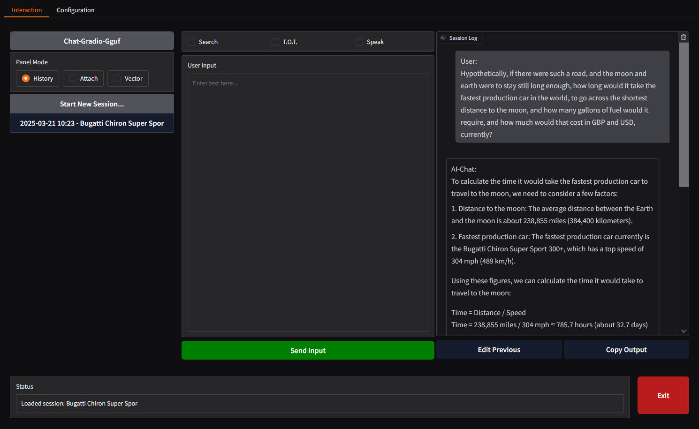
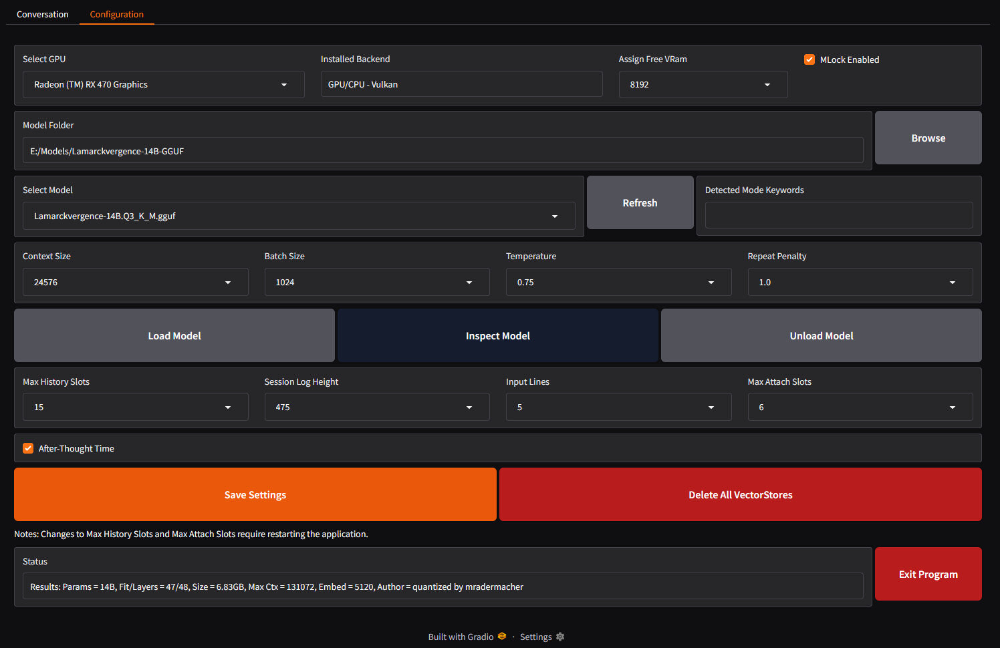

# Chat-Gradio-Gguf

<br>Status: Beta - See `Development` section..

## Description
Intended as a high-quality chat interface programmed towards windows 10 non-WSL, with any Cpu/Gpu on GGUF models. Dynamic prompting from keywords in models enabling better, interface and prompts, for relating theme of session, With some features but no imposed, limitations or guidelines. This tool providing local, uncensored, and inference with features that enhance productivity and usability, even a comparable interface, found on premium AI services, or as far in that direction as, Gradio and Grok3Beta and gguf models, will allow. The configuration is without options reported to make no difference on most models, ensuring a comprehensive yet streamlined experience.

### Features
- **Comprihensive CPU/GPU Support**: CPUs x64-CPU/AVX2/AVX512 and GPUs AMD/nVIDIA/Intel, with dropdown list selection supporting multi CPU/GPU setup.
- **Research-Grade Tools**: Includes RAG, web search, chunking, summarization, TOT, no-THINK, and code formatting, and with file attachments. 
- **Common File Support**: Handles `.bat`, `.py`, `.ps1`, `.txt`, `.json`, `.yaml`, `.psd1`, `.xaml`, and other common formats of files.
- **Configurable Context**: Set model context to 8192-138072, and batch output to 1028-4096.
- **Enhanced Interface Controls**: Load/unload models, manage sessions, shutdown, and configure settings.
- **Highly Customizable UI**: Configurable; 10-20 Session History slots, 2-10 file slots, Session Log 400-550px height, 2-8 Lines of input. 
- **Speak Summaries**: Click `Say Summary` for a special prompt for a concise spoken summary of the generated output. Text to speak uses `PyWin32`.
- **Attach Files**: Attach Files is complete raw input, there is no Vectorise Files anymore, so the files should ideally be small enough to fit in context. 
- **Collapsable Left Column**: Like one would find on modern AI interface, but with concise 3 button interface for commonly used buttons. 
- **ASynchronous Response Stream**: Separate thread with its own event loop, allowing chunks of response queued/processed without blocking Gradio UI event loop.
- **Reasoning Compatible**: Dynamic prompt system adapts handling for reasoning models optimally, ie, uncensored, nsfw, chat, code.
- **Virtual Environment**: Isolated Python setup in `.venv` with `models` and `data` directories.

### Preview
- When Requires are installed, startup looks like this in the command console...
```
=======================================================================================================================
    Chat-Gradio-Gguf: Launcher
=======================================================================================================================

Starting Chat-Gradio-Gguf...
Activated: `.venv`
Checking Python libraries...
Success: All Python libraries verified                       [GOOD]
Starting `launcher` Imports.
`launcher` Imports Complete.
Starting `launcher.main`.
Working directory: C:\Program_Filez\Chat-Gradio-Gguf\Chat-Gradio-Gguf-main
Data directory: C:\Program_Filez\Chat-Gradio-Gguf\Chat-Gradio-Gguf-main\data
Loading persistent config...
Scanning directory: E:\Models\T3Q-qwen2.5-14b-v1.0-e3-GGUF
Models Found: ['T3Q-qwen2.5-14b-v1.0-e3.Q6_K.gguf']
Launching Gradio Interface...
* Running on local URL:  http://127.0.0.1:7860
* To create a public link, set `share=True` in `launch()`.


```

- The "Interaction" page, where the conversation happens...


- The collapseable Left Panel on the `Interaction` page...


- The "Configuration" page - for configuration of, models and hardware, and relevant components, as well as ui customization...


## Requirements
- Windows 10/11 - Its a Windows program, it may be linux compatible later (not now).
- Llama.Cpp - Options here for, Avx2, Vulkan, Kompute, Cuda 11, Cuda 12.
- Python => 3.8 (tested on 3.11.0) - Libraries used = Gradio, LangChain, llama-cpp-python, FAISS.
- Llm Model - You will need a Large Language Model in GGUF format, See `Models` section.
- Suitable CPU/GPU - Gpu may be, Main or Compute, with VRam 2-64GB, testing on rx470 in Compute.  

### Instructions
1. Download a "Release" version, when its available, and unpack to a sensible directory, like, `C:\Program_Filez\Chat-Gradio-Gguf` or `C:\Programs\Chat-Gradio-Gguf`. 
2. Right click the file `Chat-Gradio-Gguf.bat`, and `Run as Admin`, the Batch Menu will then load, then select `2` from the Batch Menu, to begin installation. You will be prompted to select a Llama.Cpp version to install, which should be done based on your hardware. After which, the install will begin, wherein Python requirements will install to a `.\venv` folder. After the install completes, check for any install issues, you may need to install again if there are.
3. You will then be returned to the Batch Menu, where you, now and in future, select `1` to run to run `Chat-Gradio-Gguf`. You will then be greeted with the `Interaction` page, but you will first be going to the `Configuration` page. 
4. On the `Configuration` page you would configure appropriately, its all straight forwards, but remember to save settings and load model. If the model loads correctly it will say so in the `Status Bar` on the bottom od the display.
- VRAM dropdown, 1GB to 32GB in steps, this should be your FREE ram available on the selected card.
5. Go back to the `Interaction` page and begin interactions, ensuring to notice features available, and select appropriately for your, specific model and use cases.
6. When all is finished, click `Exit` on the bottom right and/or close browser-tabs/terminals, however you want to do it.

### Notation 
- We use a calculation of `1.125`, the calculation is `TotalVRam /((ModelFileSize * 1.125) / NumLayers = LayerSize) = NumLayersOnGpu`.
- For downloading large files such as LLM in GGUF format, then typically I would use  [DownLord](https://github.com/wiseman-timelord/DownLord), instead of lfs.
- This project is for a chat interface, and is not intended to overlap with my other projects, `Rpg-Gradio-Gguf`, or the blueprints for, `Code-Gradio-Gguf` or `Agent-Gradio-Gguf`.
- Afterthought Countdown is, <25 characters then 1s or 26-100 charactrs then 3s or >100 lines then 5s, cooldown before proceeding, enabling cancelation relative to input.
<details>
  <summary>- This is not even 1/5 of the bs involved in one of the updates...see the work I do, impressed? Please help out and donate to cover the, coffee and cigaretts, expense.,  ></summary>
```
INFORMATION: 
We are working on "Chat-Gradio-Gguf"...

Intended as a high-quality chat interface programmed towards windows 10 non-WSL, with any Cpu/Gpu on GGUF models. Dynamic prompting from keywords in models enabling better, interface and prompts, for relating theme of session, With some features but no imposed, limitations or guidelines. This tool providing local, uncensored, and inference with features that enhance productivity and usability, even a comparable interface, found on premium AI services, or as far in that direction as gguf models, will allow. The configuration is without options reported to make no difference on most models, ensuring a comprehensive yet streamlined experience.

...the file structure is like this...

Core Project files...
project_root/
│ Chat-Gradio-Gguf.bat
│ requisites.py
│ launcher.py
├── media/
│ └── project_banner.jpg
├── scripts/
│ └── interface.py
│ └── models.py
│ └── prompts.py
│ └── settings.py
│ └── temporary.py
│ └── utlity.py

...files created during install includes...

Installed/Temporary files...
project_root/
├── data/
│ └── persistence.json
├── data/vectors/
└─────── *
├── data/temp/
└────── *
├── data/history
└────── *
├── .venv/
└────── *

INSTRUCTION: 
in my scripts Qwen3 is working with, llama-cpp-python and llama.cpp pre-compiled binaries, and despite spending a week trying to make it work with AI, i have failed. The key barrier is, I want to keep installation simpler, so as to not require build-tools for building llama-cpp-python, so I think we are using some kind of pre-combined wheel. However...I looked at the releases of llama.cpp pre-compiled binary and it said...

b5480
llama : add support for Qwen3 MoE tied word embeddings (#13768)

...while requisites.py says it installs...

LLAMACPP_TARGET_VERSION =a "b5498"

When we look at the output from llama-cpp-python, we can see that the, architecture and layers, are clearly there....

llama_model_loader: - kv   0:                       general.architecture str              = qwen3
llama_model_loader: - kv   1:                               general.type str              = model
llama_model_loader: - kv   2:                               general.name str              = Qwen3 8B Abliterated
llama_model_loader: - kv   3:                           general.finetune str              = abliterated
llama_model_loader: - kv   4:                           general.basename str              = Qwen3
llama_model_loader: - kv   5:                         general.size_label str              = 8B
llama_model_loader: - kv   6:                          qwen3.block_count u32              = 36
llama_model_loader: - kv   7:                       qwen3.context_length u32              = 40960
llama_model_loader: - kv   8:                     qwen3.embedding_length u32              = 4096
llama_model_loader: - kv   9:                  qwen3.feed_forward_length u32              = 12288
llama_model_loader: - kv  10:                 qwen3.attention.head_count u32              = 32
llama_model_loader: - kv  11:              qwen3.attention.head_count_kv u32              = 8
llama_model_loader: - kv  12:                       qwen3.rope.freq_base f32              = 1000000.000000
llama_model_loader: - kv  13:     qwen3.attention.layer_norm_rms_epsilon f32              = 0.000001
llama_model_loader: - kv  14:                 qwen3.attention.key_length u32              = 128
llama_model_loader: - kv  15:               qwen3.attention.value_length u32              = 128
llama_model_loader: - kv  16:                       tokenizer.ggml.model str              = gpt2

...so llama-cpp-python is doing its job, but produces an error...

llama_model_load: error loading model: error loading model architecture: unknown model architecture: 'qwen3'

...because the latest pre-built wheel for llama-cpp-python is 0.3.2 as shown here https://github.com/abetlen/llama-cpp-python/releases/download/v0.3.2/llama_cpp_python-0.3.2-cp311-cp311-win_amd64.whl.for completeness (and you should ignore this unless you need to refer to it as there is a lot to deal with here, come back to this next bit joing here if you need it.

Scanning directory: E:\Models\Qwen3-4B-abliterated-GGUF
Models Found: ['Qwen3-4B-abliterated-q6_k_m.gguf']
Choices returned: ['Qwen3-4B-abliterated-q6_k_m.gguf'], Setting value to: Qwen3-4B-abliterated-q6_k_m.gguf
llama_model_loader: loaded meta data with 34 key-value pairs and 398 tensors from E:\Models\Qwen3-4B-abliterated-GGUF\Qwen3-4B-abliterated-q6_k_m.gguf (version GGUF V3 (latest))
llama_model_loader: Dumping metadata keys/values. Note: KV overrides do not apply in this output.
llama_model_loader: - kv   0:                       general.architecture str              = qwen3
llama_model_loader: - kv   1:                               general.type str              = model
llama_model_loader: - kv   2:                               general.name str              = Qwen3-4B-abliterated
llama_model_loader: - kv   3:                           general.finetune str              = 3129e1ebf6cc410eeb9b10696ee5cff98ee274b0
llama_model_loader: - kv   4:                         general.size_label str              = 4.0B
llama_model_loader: - kv   5:                          qwen3.block_count u32              = 36
llama_model_loader: - kv   6:                       qwen3.context_length u32              = 40960
llama_model_loader: - kv   7:                     qwen3.embedding_length u32              = 2560
llama_model_loader: - kv   8:                  qwen3.feed_forward_length u32              = 9728
llama_model_loader: - kv   9:                 qwen3.attention.head_count u32              = 32
llama_model_loader: - kv  10:              qwen3.attention.head_count_kv u32              = 8
llama_model_loader: - kv  11:                       qwen3.rope.freq_base f32              = 1000000.000000
llama_model_loader: - kv  12:     qwen3.attention.layer_norm_rms_epsilon f32              = 0.000001
llama_model_loader: - kv  13:                 qwen3.attention.key_length u32              = 128
llama_model_loader: - kv  14:               qwen3.attention.value_length u32              = 128
llama_model_loader: - kv  15:                       tokenizer.ggml.model str              = gpt2
llama_model_loader: - kv  16:                         tokenizer.ggml.pre str              = qwen2
llama_model_loader: - kv  17:                      tokenizer.ggml.tokens arr[str,151936]  = ["!", "\"", "#", "$", "%", "&", "'", ...
llama_model_loader: - kv  18:                  tokenizer.ggml.token_type arr[i32,151936]  = [1, 1, 1, 1, 1, 1, 1, 1, 1, 1, 1, 1, ...
llama_model_loader: - kv  19:                      tokenizer.ggml.merges arr[str,151387]  = ["Ġ Ġ", "ĠĠ ĠĠ", "i n", "Ġ t",...
llama_model_loader: - kv  20:                tokenizer.ggml.eos_token_id u32              = 151645
llama_model_loader: - kv  21:            tokenizer.ggml.padding_token_id u32              = 151643
llama_model_loader: - kv  22:                tokenizer.ggml.bos_token_id u32              = 151643
llama_model_loader: - kv  23:               tokenizer.ggml.add_bos_token bool             = false
llama_model_loader: - kv  24:                    tokenizer.chat_template str              = \n    {{- '<|im_start|>...
llama_model_loader: - kv  25:                       general.quantized_by str              = Mungert
llama_model_loader: - kv  26:                           general.repo_url str              = https://huggingface.co/mungert
llama_model_loader: - kv  27:                        general.sponsor_url str              = https://freenetworkmonitor.click
llama_model_loader: - kv  28:               general.quantization_version u32              = 2
llama_model_loader: - kv  29:                          general.file_type u32              = 18
llama_model_loader: - kv  30:                      quantize.imatrix.file str              = /home/mahadeva/code/models/Qwen3-4B-a...
llama_model_loader: - kv  31:                   quantize.imatrix.dataset str              = /training_dir/calibration_datav3.txt
llama_model_loader: - kv  32:             quantize.imatrix.entries_count i32              = 252
llama_model_loader: - kv  33:              quantize.imatrix.chunks_count i32              = 209
llama_model_loader: - type  f32:  145 tensors
llama_model_loader: - type q6_K:  253 tensors
llama_model_load: error loading model: error loading model architecture: unknown model architecture: 'qwen3'
llama_load_model_from_file: failed to load model
Error reading model metadata for 'E:\Models\Qwen3-4B-abliterated-GGUF\Qwen3-4B-abliterated-q6_k_m.gguf': Failed to load model from file: E:\Models\Qwen3-4B-abliterated-GGUF\Qwen3-4B-abliterated-q6_k_m.gguf
Traceback (most recent call last):
  File "C:\Program_Filez\Chat-Gradio-Gguf\Chat-Gradio-Gguf-A064\scripts\models.py", line 31, in get_model_metadata
    model = Llama(
            ^^^^^^
  File "C:\Program_Filez\Chat-Gradio-Gguf\Chat-Gradio-Gguf-A064\.venv\Lib\site-packages\llama_cpp\llama.py", line 369, in __init__
    internals.LlamaModel(
  File "C:\Program_Filez\Chat-Gradio-Gguf\Chat-Gradio-Gguf-A064\.venv\Lib\site-packages\llama_cpp\_internals.py", line 56, in __init__
    raise ValueError(f"Failed to load model from file: {path_model}")
ValueError: Failed to load model from file: E:\Models\Qwen3-4B-abliterated-GGUF\Qwen3-4B-abliterated-q6_k_m.gguf

Diagnosis:
So, what I think is, that llama-cpp-python is producing the required output, however, it is not able to load the file because llama-cpp-python is unable to respond with a positive result in the test interference, and then this stops the model from being able to be loaded. The solution is, regardless of success or fail in interference, capture the required lines for architecture and layers, and progress regardless of a fail on test interference, using, the architecture and the calculated safe numbers of layers to load into the Vram, in configuration/handling of llama.cpp pre-compiled binary.
Furthermore, under the event of an error, it should be handled, and print a messages, such as, Success: Capture Architecture/Layers. and Error: Capture architecture/layers., Error: Test Interference. and Success: Test Interference, and then, as relevantly possible moving on to the model loading, using the detected/calculated parameters, or obviously if unable to capture the architecture/layers, then we should instead throw tracebacks etc.
```
</details>


### Models (Confirmed Working)
You will of course need to have a `*.Gguf` model, here are some good ones at the time, with gpt for comparrisson..    
| Model                                  | IFEval   | BBH  /\  | MATH     | GPQA     | MuSR     | MMLU              | CO2 Cost  |
|----------------------------------------|----------|----------|----------|----------|----------|-------------------|-----------|
| Early GPT-4 (compare stats)                            | N/A      | ~50%*    | 42.2%    | N/A      | N/A      | 86.4%             | N/A       |
| Early GPT-4o (compare stats)                           | N/A      | ~60%*    | 52.9%*   | N/A      | N/A      | 87.5%*            | N/A       |
| [Lamarckvergence-14B-GGUF](https://huggingface.co/mradermacher/Lamarckvergence-14B-GGUF) (14B)          | 76.56%   | 50.33%   | 54.00%   | 15.10%   | 16.34%   | 47.59% (MMLU-PRO) | N/A       |
| qwen2.5-test-32b-it (32B)              | 78.89%   | 58.28%   | 59.74%   | 15.21%   | 19.13%   | 52.95%            | 29.54 kg  |
| [T3Q-qwen2.5-14b-v1.0-e3-GGUF](https://huggingface.co/mradermacher/T3Q-qwen2.5-14b-v1.0-e3-GGUF) (14B)      | 73.24%   | 65.47%   | 28.63%   | 22.26%    | 38.69%   | 54.27% (MMLU-PRO) | 1.56 kg   |
| [T3Q-qwen2.5-14b-v1.0-e3-Uncensored-DeLMAT-GGUF](https://huggingface.co/mradermacher/T3Q-qwen2.5-14b-v1.0-e3-Uncensored-DeLMAT-GGUF/tree/main) (14B)      | ~73.24%   | ~65.47%   | ~28.63%   | ~22.26%    | ~38.69%   | ~54.27% (MMLU-PRO) | ~1.56 kg   |
| [Qwen2.5-Dyanka-7B-Preview-GGUF](https://huggingface.co/mradermacher/Qwen2.5-Dyanka-7B-Preview-GGUF) (7B)     | 76.40%   | 36.62%   | 48.79%   | 8.95%    | 15.51%   | 37.51% (MMLU-PRO) | 0.62 kg   |
| [Qwen2.5-Dyanka-7B-Preview-Uncensored-DeLMAT-GGUF](https://huggingface.co/mradermacher/Qwen2.5-Dyanka-7B-Preview-Uncensored-DeLMAT-GGUF) (7B)     | ~76.40%   | ~36.62%   | ~48.79%   | ~8.95%    | ~15.51%   | ~37.51% (MMLU-PRO) | ~0.62 kg   |
| [qwen2.5-7b-cabs-v0.4-GGUF](https://huggingface.co/mradermacher/qwen2.5-7b-cabs-v0.4-GGUF) (7B)          | 75.83%   | 36.36%   | 48.39%   | 7.72%    | 15.17%   | 37.73% (MMLU-PRO) | N/A       |
| [Q2.5-R1-3B-GGUF](https://huggingface.co/mradermacher/Q2.5-R1-3B-GGUF) (3B)                    | 42.14%   | 27.20%   | 26.74%   | 7.94%    | 12.73%   | 31.26% (MMLU-PRO) | N/A       |

### Models (in the works)
Either, compatibility in progress or not confirmed, with gpt for comparrisson..    
| Model                                  | IFEval   | BBH  /\  | MATH     | GPQA     | MuSR     | MMLU              | CO2 Cost  |
|----------------------------------------|----------|----------|----------|----------|----------|-------------------|-----------|
| Early GPT-4 (compare stats)                           | N/A      | ~50%*    | 42.2%    | N/A      | N/A      | 86.4%             | N/A       |
| Early GPT-4o (compare stats)                           | N/A      | ~60%*    | 52.9%*   | N/A      | N/A      | 87.5%*            | N/A       |
| [Qwen3-30B-A3B-GGUF](https://huggingface.co/mradermacher/Qwen3-30B-A3B-abliterated-GGUF) (30B)      | N/A  | N/A   | 80.4%   | 65.8%   | 72.2%   | N/A           | N/A   |
| calme-3.2-instruct-78b (78B)           | 80.63%   | 62.61%   | 40.33%   | 20.36%   | 38.53%   | 70.03%            | 66.01 kg  |

<details>
  <summary>Table Key ></summary>

    - IFEval (Instruction-Following Evaluation) - Measures how well an AI model understands and follows natural language instructions.
    - BBH (Big-Bench Hard) - A challenging benchmark testing advanced reasoning and language skills with difficult tasks.
    - MATH - Evaluates an AI model’s ability to solve mathematical problems, from basic to advanced levels.
    - GPQA (Graduate-Level Google-Proof Q&A) - Tests an AI’s ability to answer tough, graduate-level questions that require deep reasoning, not just web lookups.
    - MuSR (Multi-Step Reasoning) - Assesses an AI’s capability to handle tasks needing multiple logical or reasoning steps.
    - MMLU (Massive Multitask Language Understanding) - A broad test of general knowledge and understanding across 57 subjects, like STEM and humanities.
    - CO2 Cost - Quantifies the carbon dioxide emissions from training or running an AI model, reflecting its environmental impact.
</details>
<details>
  <summary>Keyword Info ></summary>
    
    Keywords in model label will dynamically adapt the prompt appropriately...
    - `Vanilla Chat` keywords - none of the below.
    - `Coding` keywords - "code", "coder", "program", "dev", "copilot", "codex", "Python", "Powershell".
    - `UnCensored` keywords - "uncensored", "unfiltered", "unbiased", "unlocked".
    - `reasoning` keywords - "reason", "r1", "think".
```
</details>

## Development
- Core Project files...
```
project_root/
│ Chat-Gradio-Gguf.bat
│ requisites.py
│ launcher.py
├── media/
│ └── project_banner.jpg
├── scripts/
│ └── interface.py
│ └── models.py
│ └── prompts.py
│ └── settings.py
│ └── temporary.py
│ └── utlity.py
```
- Installed/Temporary files...
```
project_root/
├── data/
│ └── persistence.json
├── data/vectors/
└─────── *
├── data/temp/
└────── *
├── data/history
└────── *
├── .venv/
└────── *
```

# Current
1. Qwen 3 and Deepseek 3, compatibility/integration/features. Make test script for both had issues, instead make individual test scripts, just getting one of them working first may be in order.
2. Need to simplify streaming, I want it character by character instead of chunking into words/sentences, so as to simplify. As a result hopefully remove occurences of no response until the complete thing is outputted, just print it how it comes, subject to whatever filters are present.
3. There is no stop button.

# Distant
1. **Safe Globals** - Standardize all global variables using safe, unique three-word labels to avoid conflicts.  
2. **Cross-Platform Scripting:** Introduce a unified script (`Chat-Gradio-Gguf.sh`) to support both Linux and Windows environments, and adapt scripts appropriately. 
3. Introduce a collapseable right side bar, lilke the left one but on the right, again a "C-G-G" button, that expands out to a "Chat-Gradio-Gguf" button, in the expanded panel here I want...
- a row with a square box, that visualizes the thinking/generation, in some simple method, that is somehow interesting, and under that, a row with a buttton to turn "Visualize" ON/OFF.
- a row with 3 boxes each with 1 stat for generation speed/whatever else is typically of interest to people.
- a row with 2 butttons, 1 to turn "Visualize" ON/OFF and 1 to turn "Statistics" on/off. Same kind of on/off buttons as web-Search/Speech/Summary.
- sliders for, context size and batch size, affecting them will affect the ones on the configuration page, and vice versa. They use the same global in temporary. we would then need to ensure that whatever settings are selected on either/both, will then be active for when the next time the user clicks send.

## Credits
Thanks to all the following teams, for their parts...
- [Llama.Cpp](https://github.com/ggml-org/llama.cpp) - Core library for interference with models.
- [Yake](https://github.com/LIAAD/yake) - Library used for generating the labels for the history slots.
- [Grok3Beta](https://x.com/i/grok) - For much of the complete updated functions that I implemented.
- [Deepseek R1/3](https://www.deepseek.com/) - For re-attempting the things Grok3Beta was having difficulty with.
- [Perplexity](https://www.perplexity.ai) - For circumstances of extensive web research requierd.


## License
This repository features **Wiseman-Timelord's Glorified License** in the file `.\Licence.txt`, in short, `if you wish to use most of the code, then you should fork` or `if you want to use a section of the code from one of the scripts, as an example, to make something work you mostly already have implemented, then go ahead`.

