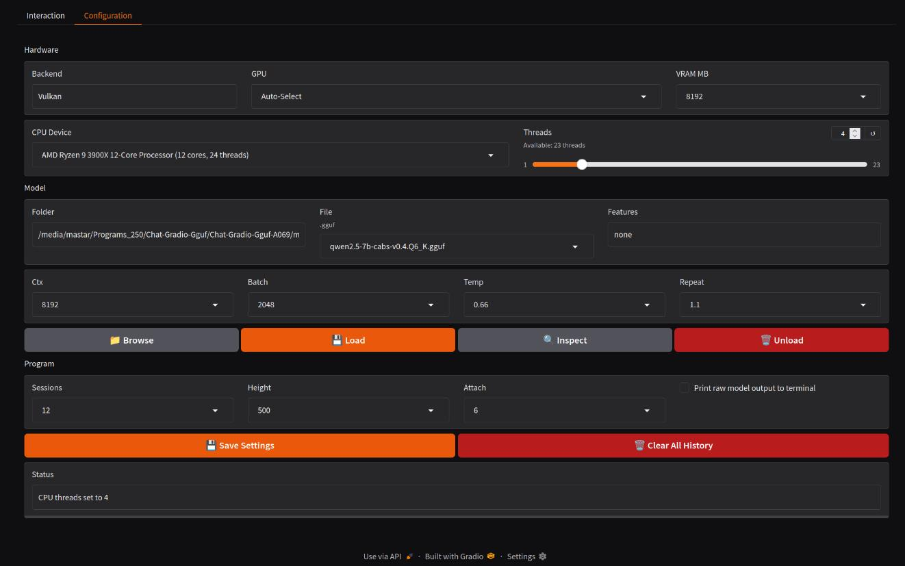

# Chat-Gradio-Gguf
```
=======================================================================================================================
"                                  _________           ________          ________                                     "
"                                  \_   ___ \         /  _____/         /  _____/                                     "
"                                  /    \  \/  ______/   \  ___  ______/   \  ___                                     "
"                                  \     \____/_____/\    \_\  \/_____/\    \_\  \                                    "
"                                   \______  /        \______  /        \______  /                                    "
"                                          \/                \/                \/                                     "
-----------------------------------------------------------------------------------------------------------------------
```
Status: Beta - Testing and bugfixing.

## Description
A high-quality chat interface with uses include, Codeing, Rpg Game, Chat, with enhancements, for windows 10 with any GPU on GGUF models. Dynamic modes enabling correct, interface and prompts, for relating theme of sessions, With the latest advancements. This tool providing local, uncensored, and inference with features that enhance productivity and usability, even a comparable interface, found on premium AI services, or a far in that direction as Gradio will allow. The configuration is without options reported to make no difference on most models, ensuring a comprehensive yet streamlined experience. Capable of all things possible through simple scripts and awesome libraries and modern GGUF LLMs.

### Features
- **Operation Modes **:  "Auto" (filename keywords), "Chat", "Chat-Reasoning", "Chat-Uncensored", "Chat-Uncensored-Reasoning", "Chat-TOT", "Chat-Uncensored-TOT", "Coder", "Coder-Instruct", "Rpg", "Rpg-NSFW".
- **GPU Support**: Compatible with AMD/NVIDIA/Intel GPUs via Vulkan/Kompute/Cuda/Avx2, with GPU selection dropdown.
- **Research-Grade Tools**: Includes RAG, web search, chunking, summarization, and code formatting.
- **Virtual Environment**: Isolated Python setup in `.venv` with `models` and `data` directories.
- **Simplified File Support**: Handles `.bat`, `.py`, `.ps1`, `.txt`, `.json`, `.yaml`, `.psd1`, `.xaml` files.
- **Configurable Context Window**: Set `n_ctx` to 8192, 16384, 24576, or 32768 via dropdown.
- **Enhanced Interface Controls**: Load/unload models, manage sessions, shutdown, and configure settings.
- **FAISS Vector Database**: Stores numerical vectors, and retrieves based on proximity in meaning, enabling pulling context from documents.
- **Session History Rotation**: 11 Session History slots on rotation, enabling load recent sessions, while not using excessive space. 

### Preview
- The "Conversation" page, some elements are dynamic now...


- The, refined and improved, "Configuration" page...


- The Terminal Display...
```
=======================================================================================================================
    Chat-Gradio-Gguf: Launcher
=======================================================================================================================

Starting Chat-Gradio-Gguf...
Starting `launcher` Imports.
`launcher` Imports Complete.
Starting `launcher.main`.
Running on local URL:  http://127.0.0.1:7860

To create a public link, set `share=True` in `launch()`.


```

## Requirements
- Windows 10/11 - Its a Windows program, it may be linux compatible later (not now).
- Llama.Cpp - Options here for, Avx2, Vulkan, Kompute, Cuda 11, Cuda 12.
- Python => 3.8 - Libraries used = Gradio, LangChain, llama-cpp-python, FAISS.
- Llm Model - You will need a Large Language Model in GGUF format, See below

### Instructions
1. Download a "Release" version, when its available, and unpack to a sensible directory, like, `C:\Program_Filez\Chat-Gradio-Gguf` or `C:\Programs\Chat-Gradio-Gguf`. 
2. Right click the file `Chat-Gradio-Gguf.bat`, and `Run as Admin`, the Batch Menu will then load.
3. Select `2` from the Batch Menu, to begin installation.
4. you will be prompted to select a Llama.Cpp version to install, which should be done based on your hardware.
5. After which, the install will begin, wherein Python requirements will install to a `.\venv` folder.
6. After the install completes, check for any install issues, you may need to install again if there are.
7. You will then be returned to the Batch Menu, where you, now and in future, select `1` to run to run `Chat-Gradio-Gguf`.
8. You will be greeted with the conversation page, but you will first be going to the configuration page.
9. On the `Configuration` page you would configure appropriately, its all straight forwards.
10. Go back to the `Conversation` page and begin interactions, ensuring to notice features available.

### Notation
- Tabs on left of `Chat` page; "Start New Session" at top, 10-session limit.
- Auto-labeled sessions (e.g., "Query about worms") stored in `.\data\history\*`.
- VRAM dropdown, 1GB to 32GB in steps, this should be your FREE ram available on the selected card.
- We use `(ModelFileSize * 1.1875) / NumLayers = LayerSize`, then `TotalVRam / LayerSize = NumLayersOnGpu`.
- Most GGUF text models will work, keep in mind the applicable keywords shown in `Model Label Keywords` section.
- If you like using LLMs on your own hardware, then you will probably like my program [DownLord](https://github.com/wiseman-timelord/DownLord).

### Model label/name Keywords...
1. Keywords for Operation mode...
- `Coding` keywords - "code", "coder", "program", "dev", "copilot", "codex", "Python", "Powershell".
- `RPG Game` keywords - "nsfw", "adult", "mature", "explicit", "rp", "roleplay".
- `Chat` keywords - none of the above.
2. Keywords for Enhancements...
- `UnCensored` keywords - "uncensored", "unfiltered", "unbiased", "unlocked".
- `reasoning` keywords - "reason", "r1", "think".

# Models
You will of course need to have a `*.Gguf` model for anything to work, here are the models used to test the program.. 
1. For ~8B models (Primary/Quality).
- [qwen2.5-7b-cabs-v0.4-GGUF](https://huggingface.co/mradermacher/qwen2.5-7b-cabs-v0.4-GGUF) - Best <8b Model on General leaderboard, and ~500 overall.
- Choice between, Llama [DeepSeek-R1-Distill-Llama-8B-Uncensored-GGUF](https://huggingface.co/mradermacher/DeepSeek-R1-Distill-Llama-8B-Uncensored-GGUF) and Qwen [DeepSeek-R1-Distill-Qwen-7B-Uncensored-Reasoner-GGUF](https://huggingface.co/mradermacher/DeepSeek-R1-Distill-Qwen-7B-Uncensored-Reasoner-GGUF) , versions of R1 - Uncensored <8GB, Chat and Reasoning.
- [Nxcode-CQ-7B-orpol-Gguf](https://huggingface.co/tensorblock/Nxcode-CQ-7B-orpo-GGUF) - Best on Big code Leaderboard for Python, for Coder.
- [Ninja-v1-NSFW-RP-GGUF](https://huggingface.co/mradermacher/Ninja-v1-NSFW-RP-GGUF) - Most downloaded RP NSFW on huggingface at the time.
2. For <4B models (Secondary/Fast).
- [Llama-3.2-3B-Instruct-uncensored-GGUF](https://huggingface.co/bartowski/Llama-3.2-3B-Instruct-uncensored-GGUF) - untested.
- [DeepSeek-R1-Distill-Qwen-1.5B-uncensored-GGUF](https://huggingface.co/mradermacher/DeepSeek-R1-Distill-Qwen-1.5B-uncensored-GGUF) - Uncensored Reasoning.

## Development
Complete Gen 1 of Chat-Gradio-Gguf...
- (in progress) I want the model labels to continue to be searched for keywords for other enhancements, however, the operational mode box on `conversation` page needs to be replaced with a `Operation Mode` dropdown list with 8 positions, `Auto`, `Chat`, `Chat-Reasoning`, `Chat-Uncensored`, `Chat-Uncensored-Reasoning`, `Coder`, `Coder-Instruct`, `Rpg`, `Rpg-NSFW`, where the `Auto` mode would select whatever mode was found to be the case from the keywords, this will affect the mode of operation being used in the program appropriately. Each of these modes must have some different relating enhancement or display elements or prompts, as are appropriate to the mode, as is mostly implemented in the program already. For the modes with no specific relating enhancement, please produce the research, determine what relevant features are appropriate for the relating mode, given the current themes of contents in the program. To help you out a bit, here is my thoughts, I think the current prompts for RPG need a little detail adding for the NSFW version, if you research what is a good rp nsfw prompt, then adapt my current 3 promtps. The other prompts should also be assessed, each mode should have optimal prompts. Obviously, only, `Chat`, `Chat-Uncensored`, modes will have TOT button visible, and we do not want the button to turn reasoning off, because that is now selected in the `Operation Mode` dropdown. 

- I want a new mode `Chat-Notate` and `Chat-Notate-Uncensored`, these are 2 new chat modes, however, instead of the attatchments button on the right, they will have additional button on the right column on `Conversation` page, for `Notation Library` and its related buttons, again by clicking it again its relating buttons will then be non-visible. By library we mean we are going to get the AI to, load and assess, contents of information in the selected PDF(s) individaully into a library through summarization and chunking, produce a document that summarizes the complete information in, notation and summarization, containing, critical and important, information contained in the applicable pdf,  this will require streaming of output from the pdf, and summarizing to as near as possible but not over, the context length that is set in the set in `Configuration` page, then save this as a txt file using some library to determine in the `.\data\notation` folder with 5 word concise version of a label that concisely catagorises the theme of what the information is about through some library, ie `GardenOrnamentsSeedsFlowers_24000Tokens.txt`. The original pdf title should be noted in the first line of the created txt file, stating `This concise summarization about "5WordLabel_MaxSafeContextLengthVariableValue.txt" was created from the original file "ExampleFileName.pdf"`. we are not keeping links to the original PDF after it has been concolidated completely into the document taking up maximum context available. Also requiring creation is a summarization of the maximum context version, into a 256 token version `13CharacterConciseLabel_256Tokens`, that again will start with  `This concise summarization labelled "13CharacterConciseLabel_256.txt" was created from the original file "ExampleFileName.pdf"`. The Max context versions will be the source for creating smaller versions of the same document.
- The idea is, that the user will have to browse for the files to convert them into the format of notes through loading them in, it will create these, MaxContextToken and 256Token, versions, and this is then used later to inform the AI upon notated information relevant to the subjects from assessing all available 256Token files, that are injected along with the user's inputs, the AI will not be using whatever other database it has devised through whatever other libraries, this is a special database, that is created through the use of the large language models instead of some python library for such purposes. After assessing which of the notations are most   relevant to the conversation being had, it will then produce an additional phase of researching into the most relevant notation in relevance to the user's input, and then produce an informed response influenced by the nature of the information it has just assessed from the specific notes. Thereabouts, the user should always be able to produce up to 1000 Token input so, the calculation would be `MaxSafeContextLength - 1024 = MaxSafeContextLength`, we can test that later, unless there are any other considerations you can think of, the idea is I am using a `32###` token context model at `24###` tokens anyhow. 
- 1 Dynamic Button Menu Button `Notation Library` (that makes visible the following buttons), Button 1 `Index New Pdf(s)`, Button 2 `Delete All Notes`, Button 3-12  `Empty Notation Slot` or `5WordLabel`.
- The process of chat during  the Library modes, is that the AI will have all of the concise 256 details of the database injected into the prompt from the user, and then be assessing which is the most relevant notation to research into relevant to the theme of what the user is talking about. The AI will then select and absorb the full notation based on the selected 256 concise version along with the users original inquiry, and then produce an informed response that is conformed with any perspective on the information held by the relevant documents. The idea is to talk of philosophies and such, big questions, and then be able to gain practical information, where the person you are talking to in this case the AI, is well informed upon relevant topics with deep insights into such relating matters.

## Far Development.
- the next generation of the program will be 6 modes and dual model like this...
```
| **Mode**             | **Models**                     | **Features**                                      | **Implementation Notes**                                                                 |
|-----------------------|--------------------------------|--------------------------------------------------|-----------------------------------------------------------------------------------------|
| Chatbot              | Single chat model (e.g., DeepSeek-V3) | TOT reasoning, web research                     | Use LangChain for TOT (e.g., recursive prompt splitting), SerpAPI for web queries       |
| Advanced Chatbot     | Fast + Quality chat models    | TOT on Fast, AUTO/FAST/QUALITY switch, web on Fast | Quantize Fast model (e.g., 4-bit), add Gradio slider for mode, cache Quality outputs   |
| Coder                | Single code model (e.g., DeepSeek-Coder) | Syntax, formatting, completion                | Leverage Pygments for highlighting, integrate VSCode-like keybinds                     |
| Agentic Coder        | Code + text models            | Intent → code → review loop                    | Chain via LangChain agents, store intermediate states in .\data\                       |
| RPG Text             | Single RPG model              | Narrative, character tracking, uncensored       | Parse entities with regex, save JSON states in .\data\history\                         |
| RPG Text + Images    | RPG + image model (Flux.1-schnell) | Text RPG + scene images                      | Trigger Flux via llama.cpp image fork, display in Gradio gallery (256x256 max)         |
```
- Introduction of `Chat-Gradio-Gguf.sh` file and modifications of scripts, to enable, Linux AND Windows, support. 
- Verbose Clear Concise Printed Notifications for all stages of model interaction/json handling: `Sending Prompt to Code Model...`, `Generating Code for Chat Model...`, `Response Received from Code Model...`.
- Color themes. Deepseek R1 AND Grok3Beta, found this extremely difficult, Deepseek was better. It needs to be re-attempted later, possibly with GPT4o1. Make it all shades of grey, then allow people to choose the primary button color in configuration, or something simple like that.

## Credits
- [X](https://x.com/) - [Grok](https://x.com/i/grok), at the time Grok3Beta. For much of the complete updated functions that I implemented.
- [Deepseek](https://www.deepseek.com/), at the time, 3 and R1. For re-attempting the things Grok3Beta was having difficulty with.

## License
**Wiseman-Timelord's Glorified License** is detailed in the file `.\Licence.txt`, that will later be added.

