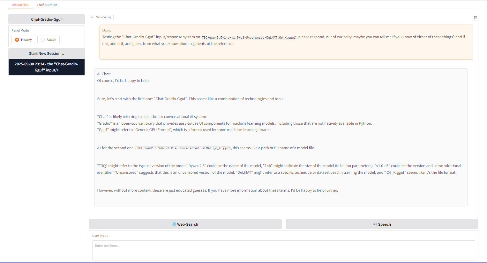

# Chat-Gradio-Gguf

<br>Status: Alpha - See `Development` section..

## Description
Intended as a high-quality chat interface programmed towards windows 10 non-WSL, with any Cpu/Gpu on GGUF models. Dynamic prompting from keywords in models enabling better, interface and prompts, for relating theme of session, With some features but no imposed, limitations or guidelines. This tool providing local, uncensored, and inference with features that enhance productivity and usability, even a comparable interface, found on premium AI services, or as far in that direction as, Gradio and Grok3Beta and gguf models, will allow. The configuration is without options reported to make no difference on most models, ensuring a comprehensive yet streamlined experience.

### Features
- **Comprihensive CPU/GPU Support**: CPUs x64-CPU/AVX2/AVX512 and GPUs AMD/nVIDIA/Intel, with dropdown list selection supporting multi CPU/GPU setup.
- **Research-Grade Tools**: Includes RAG, web search, chunking, summarization, TOT, no-THINK, and code formatting, and with file attachments. 
- **Virtual Environment**: Isolated Python setup in `.venv` with `models` and `data` directories.
- **Common File Support**: Handles `.bat`, `.py`, `.ps1`, `.txt`, `.json`, `.yaml`, `.psd1`, `.xaml`, and other common formats of files.
- **Configurable Context Window**: Set `n_ctx` to 8192, 16384, 24576, or 32768 via dropdown.
- **Enhanced Interface Controls**: Load/unload models, manage sessions, shutdown, and configure settings.
- **FAISS Vector Database**: Stores numerical vectors, and retrieves based on proximity in meaning, enabling pulling context from documents.
- **Highly Customizable UI**: Configurable; 10-20 Session History slots, 2-10 file slots, Session Log 400-550px height, 2-8 Lines of input. 
- **Afterthought Countdown**: If, <25 characters then 1s or 26-100 charactrs then 3s or >100 lines then 5s, cooldown before proceeding, enabling cancelation time relative to input size.
- **Attach or Vectorise**: Optimally for the mode, Attach Files is complete raw input, while Vectorise Files is relevance selected snippets from potentially larger source. 
- **Collapsable Left Column**: Like one would find on modern AI interface. 
- **ASynchronous Response Stream**: Separate thread with its own event loop, allowing chunks of response queued/processed without blocking Gradio UI event loop.

### Preview
- The "Interaction" page with Panel Mode selector, and enhancments bar. Left panel collapses by clicking `Chat-Gradio-Gguf`...


- The "Configuration" page - for configuration of, models and hardware, and relevant components, as well as ui customization...


- Wide Llama.Cpp support in the installer, thanks to latest ~128k ai systems, no longer having to streamline such things...
```
========================================================================================================================
    Chat-Gradio-Gguf: Install Options
========================================================================================================================


 Select the Llama.Cpp type:

    1. AVX2 - CPU Only - Must be compatible with AVX2

    2. AVX512 - CPU Only - Must be compatible with AVX512

    3. NoAVX - CPU Only - For older CPUs without AVX support

    4. OpenBLAS - CPU Only - Optimized for linear algebra operations

    5. Vulkan - GPU/CPU - For AMD/nVidia/Intel GPU with x64 CPU

    6. Kompute - GPU/CPU - Experimental Vulkan with with CPU fallback

    7. CUDA 11.7 - GPU/CPU - For CUDA 11.7 GPUs with CPU fallback

    8. CUDA 12.4 - GPU/CPU - For CUDA 12.4 GPUs with CPU fallback


========================================================================================================================
 Selection; Menu Options = 1-8, Exit Installer = X:

```

## Requirements
- Windows 10/11 - Its a Windows program, it may be linux compatible later (not now).
- Llama.Cpp - Options here for, Avx2, Vulkan, Kompute, Cuda 11, Cuda 12.
- Python => 3.8 (tested on 3.11.0) - Libraries used = Gradio, LangChain, llama-cpp-python, FAISS.
- Llm Model - You will need a Large Language Model in GGUF format, See `Models` section.
- Suitable CPU/GPU - Gpu may be, Main or Compute, with VRam 2-64GB, testing on rx470 in Compute.  

### Instructions
1. Download a "Release" version, when its available, and unpack to a sensible directory, like, `C:\Program_Filez\Chat-Gradio-Gguf` or `C:\Programs\Chat-Gradio-Gguf`. 
2. Right click the file `Chat-Gradio-Gguf.bat`, and `Run as Admin`, the Batch Menu will then load, then select `2` from the Batch Menu, to begin installation. You will be prompted to select a Llama.Cpp version to install, which should be done based on your hardware. After which, the install will begin, wherein Python requirements will install to a `.\venv` folder. After the install completes, check for any install issues, you may need to install again if there are.
3. You will then be returned to the Batch Menu, where you, now and in future, select `1` to run to run `Chat-Gradio-Gguf`. You will then be greeted with the `Interaction` page, but you will first be going to the `Configuration` page. 
4. On the `Configuration` page you would configure appropriately, its all straight forwards, but remember to save settings and load model. If the model loads correctly it will say so in the `Status Bar` on the bottom od the display.
5. Go back to the `Interaction` page and begin interactions, ensuring to notice features available, and select appropriately for your, specific model and use cases.
6. When all is finished, click `Exit` on the bottom right and/or close browser-tabs/terminals, however you want to do it. 

### Notation
- VRAM dropdown, 1GB to 32GB in steps, this should be your FREE ram available on the selected card.
- We use a calculation of `1.125`, the calculation is `TotalVRam /((ModelFileSize * 1.125) / NumLayers = LayerSize) = NumLayersOnGpu`.
- Most GGUF text models will work, keep in mind the applicable keywords shown in `Model Label Keywords` section, for enhancement detection.
- For downloading large files such as LLM in GGUF format, then typically I would use  [DownLord](https://github.com/wiseman-timelord/DownLord), instead of lfs.
- Rpg elements were overlapping with `Rpg-Gradio-Gguf`, so removed Rpg elements. This prompts Rpg-Gradio-Gguf to be worked on.
- Coder mode was not possible without dual model, due to needing a text to instruct conversion, so inspired project `Code-Gradio-Gguf`, TBA.
- This project was re-branded from `Text-Gradio-Gguf`, inline with doing rpg and code in other programs.

### Model label/name Keywords...
Keywords in model label will dynamically adapt the prompt appropriately...
- `Vanilla Chat` keywords - none of the below.
- `Coding` keywords - "code", "coder", "program", "dev", "copilot", "codex", "Python", "Powershell".
- `UnCensored` keywords - "uncensored", "unfiltered", "unbiased", "unlocked".
- `reasoning` keywords - "reason", "r1", "think".

# Models
You will of course need to have a `*.Gguf` model, use an iMatrix version of the same models if you have nVidia hardware. Here are some of the models used to test the program.. 
1. For non-iMatrix 14B models...
- [T3Q-qwen2.5-14b-v1.0-e3-GGUF](https://huggingface.co/mradermacher/T3Q-qwen2.5-14b-v1.0-e3-GGUF) - New Best ~14B model, 14th place overall. Its Qwen but seems to work with my program.
- [Lamarckvergence-14B-GGUF](https://huggingface.co/mradermacher/Lamarckvergence-14B-GGUF) - Best ~14B model, ~65th overall beating most ~70B, tested and working.
2. For non-iMatrix ~8B models.
- Llama [DeepSeek-R1-Distill-Llama-8B-Uncensored-GGUF](https://huggingface.co/mradermacher/DeepSeek-R1-Distill-Llama-8B-Uncensored-GGUF) 8GB cutdown but somewhat compitent - Uncensored.
- [Ninja-v1-NSFW-RP-GGUF](https://huggingface.co/mradermacher/Ninja-v1-NSFW-RP-GGUF) - Most downloaded RP NSFW on huggingface at the time.
3. Models that do not work...
- Qwen based models, such as, [DeepSeek-R1-Distill-Qwen-7B-Uncensored-Reasoner-GGUF](https://huggingface.co/mradermacher/DeepSeek-R1-Distill-Qwen-7B-Uncensored-Reasoner-GGUF) and [qwen2.5-7b-cabs-v0.4-GGUF](https://huggingface.co/mradermacher/qwen2.5-7b-cabs-v0.4-GGUF) and [DeepSeek-R1-Distill-Qwen-1.5B-uncensored-GGUF](https://huggingface.co/mradermacher/DeepSeek-R1-Distill-Qwen-1.5B-uncensored-GGUF)
- Instruct based models, such as [Nxcode-CQ-7B-orpol-Gguf](https://huggingface.co/tensorblock/Nxcode-CQ-7B-orpo-GGUF) and [Llama-3.2-3B-Instruct-uncensored-GGUF](https://huggingface.co/bartowski/Llama-3.2-3B-Instruct-uncensored-GGUF).


## File Structure
- Core Project files...
```
project_root/
│ Chat-Gradio-Gguf.bat
│ requisites.py
│ launcher.py
├── media/
│ └── project_banner.jpg
├── scripts/
│ └── interface.py
│ └── models.py
│ └── prompts.py
│ └── temporary.py
│ └── utlity.py
```
- Installed/Temporary files...
```
project_root/
├── data/
│ └── persistence.json
├── data/vectors/
└─────── *
├── data/temp/
└────── *
├── data/history
└────── *
├── .venv/
└────── *
```

## Current Development
With regards to the current version of the program...
1. Output Format is incorrect. ISsue with bullet points being printed correctly while using a non-think, non-tot, non-search, mode.
1. It is now Chat only, and streamlined as a result. This is all now do-able without agentic workflows. It has mostly/all already been working in earlier versions, just need to fix the features based on what I already figured out. 
1. Continue work on prompting system until it works soundly, check all model keywords themes with enhancement combination (note text to speak uses `PyWin32`). 
5. Output is now brokwn. It seemed to work before as a subprocess while printing output, and stream when its the final response or for direct answers. We want streaming raw text input/output to the command window, while keeping it as subprocess, for the gradio display to update correctly.
6. I want to go back to the `█` in the status bar for progress indication, each iteration representing one sentence, while for the session log and display to be updating for each complete sentence written, then finally when it is complete resuming normal operation. I did very much like it when I was able to see each sentence appear streaming as complete sentence as each was completely written, while a `█` in the status bar for each complete sentence be it while the model is thinking or doing tot or something, or when it is printing the final output or selected output, but this progress on the status bar should only be applicable while there is text being generated that will not be displayed, so people can see something is going on, however, if we can not do that when its actually printing the material that will be used in the session log, be it the complete output or just a selection of it, then it should not accumulate any more `█` and instead say `Streaming Response...` if its currently in a phase of streaming complete sentences to the session log.
4. **Enhanced Notation Modes:**  
   - Introduce “Chat-Notate” and “Chat-Notate-Uncensored” modes to process uploaded PDFs into both detailed and concise summaries.  
   - Disable the THINK phase in these modes to ensure practical, notation-driven conversations.  

## Far Development
1. **Safe Globals** - Standardize all global variables using safe, unique three-word labels to avoid conflicts.  
7. re-attempt left column collapse switch with two images in `.\media` instead of text, so as to be in-line with quality graphic I made for this readme.md. 
8. Research local and online AI programs, what kinds of enhancements are common, what would be simple to implement, and would be better way of donig things or add something. Someone mentioned Manu, one to check out does some kind of webscrape or internet research, producing reports.
- Use something like llama-box to Integrate vision capabilities for image recognition on web searches and convert images into contextually relevant thumbnails (with full images accessible via pop-up).   
2. **Cross-Platform Scripting:** Introduce a unified script (`Chat-Gradio-Gguf.sh`) to support both Linux and Windows environments, and adapt scripts appropriately. 
3. **User Interface and Notification Enhancements:**  
   - Implement verbose, clear, and concise printed notifications for all stages of model interaction (e.g., "Sending Prompt to Code Model...", "Response Received from Code Model...").   
   - maintain critical inclusion of Debug notification for terminal, as each are needed to be worked through.

## Credits
- [Grok3Beta](https://x.com/i/grok) - For much of the complete updated functions that I implemented.
- [Deepseek R1/3](https://www.deepseek.com/) - For re-attempting the things Grok3Beta was having difficulty with.
- [Claude_Sonnet](https://claude.ai) - For a smaller amount of the work on this project, useually when there was issue with the other 2 above.
- [Perplexity](https://www.perplexity.ai) - For research to look at more sites than normal, also notice its agentic now.

## License
**Wiseman-Timelord's Glorified License** is detailed in the file `.\Licence.txt`, that will later be added.

